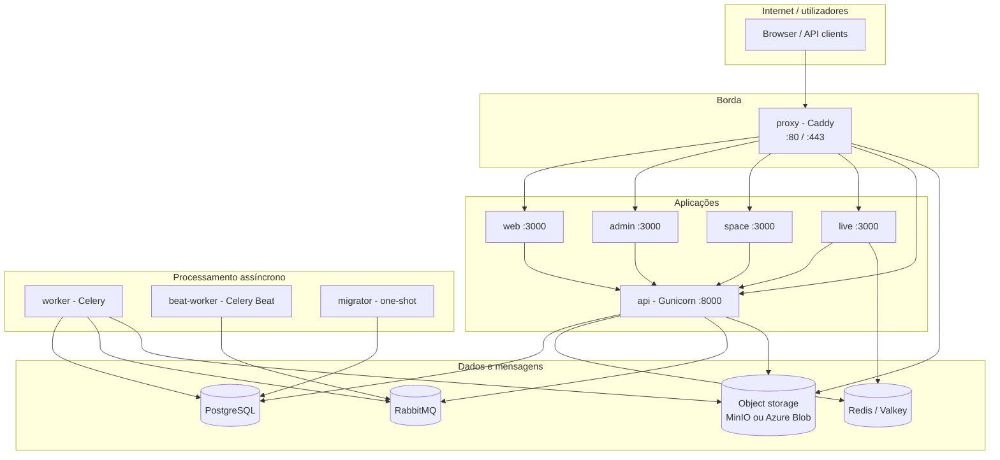
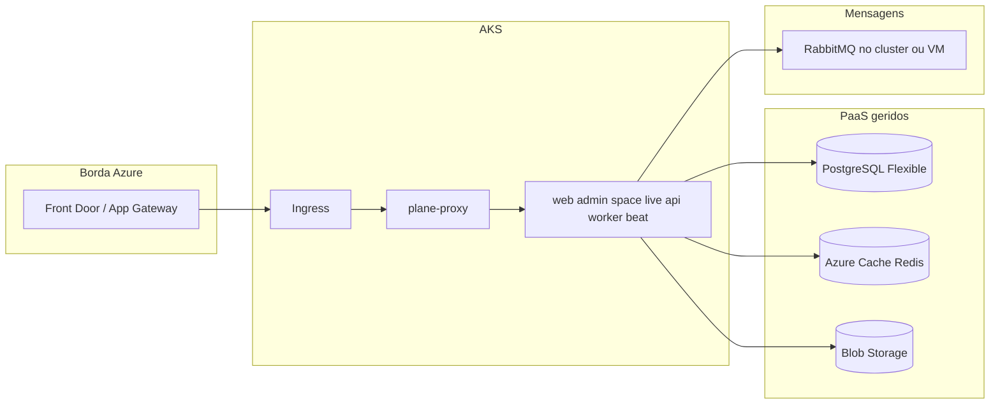

# Arquitetura do projeto — guia DevOps e Azure

Documento de referência para equipas de **infraestrutura**, **DevOps** e **SRE**. Descreve a arquitetura do fork **Plane / Tech4Humans** neste repositório, os componentes em runtime, dependências de dados, rede e um **mapeamento sugerido para Microsoft Azure**.

**Público-alvo:** quem vai fazer deploy, monitorização, backup e dimensionamento — não é um tutorial de desenvolvimento local (ver [CONTRIBUTING.md](../CONTRIBUTING.md)).

**Última atualização:** maio/2026  
**Versão do monorepo:** `1.3.1` (ver `package.json` na raiz)

---

## 1. Resumo executivo

| Aspecto | Descrição |
|--------|-----------|
| **Produto** | Gestão de trabalho (issues, ciclos, módulos, páginas, analytics) — fork open-source do [Plane](https://plane.so) com camada **Board** (Tech4Humans). |
| **Modelo de deploy** | **Self-hosted**: vários contentores Docker orquestrados (Compose ou Swarm); Helm chart oficial na comunidade Plane. |
| **Backend** | **Django** + **Django REST Framework** (`apps/api`), API HTTP na porta **8000**. |
| **Frontends** | **React Router 7** + **Vite** — app principal (`web`), admin (`admin`), publicação (`space`), colaboração em tempo real (`live`). |
| **Assíncrono** | **Celery** (workers + beat) com broker **RabbitMQ**; cache/sessões/live usam **Redis/Valkey**. |
| **Dados** | **PostgreSQL 15** (dados transacionais); **S3-compatible** (MinIO em dev/compose ou Azure Blob em produção). |
| **Entrada única** | **Caddy** (`apps/proxy`) — TLS, roteamento por path, proxy de uploads para object storage. |

**Requisito mínimo de referência (Plane upstream):** VM com **2 vCPU / 4 GB RAM** para Compose simples; desenvolvimento local recomenda **12 GB RAM** (build Docker + `pnpm dev`).

---

## 2. Visão de alto nível (produção)



### 2.1 Fluxo de pedido típico

1. O utilizador acede ao **domínio público** (ex.: `https://plane.tech4humans.com`).
2. O **proxy** termina TLS e encaminha por path (ver §5).
3. O **web** (SPA) chama a API em `/api/*` (mesmo host, evita CORS complexo em produção).
4. Operações pesadas (email, webhooks, exportações, notificações) vão para filas **Celery** via **RabbitMQ**.
5. Ficheiros (anexos, imagens) são guardados em **object storage**; URLs podem passar pelo proxy (`/uploads/*`) ou endpoint público do storage.

---

## 3. Estrutura do repositório (monorepo)

```
plane/
├── apps/
│   ├── api/          # Django — API REST, auth, modelos, Celery tasks
│   ├── web/          # App principal (React Router)
│   ├── admin/        # "God mode" — administração da instância
│   ├── space/        # Publicação / visão pública de projetos
│   ├── live/         # Servidor Hocuspocus (Yjs) — edição colaborativa
│   └── proxy/        # Caddy — reverse proxy + TLS (Community Edition)
├── packages/         # Bibliotecas partilhadas (@operis/types, ui, i18n, editor, …)
├── deployments/
│   ├── cli/community/    # Docker Compose / Swarm (imagens makeplane/*)
│   ├── kubernetes/community/  # Helm (Artifact Hub: makeplane/plane-ce)
│   └── aio/community/    # All-in-one (variante simplificada)
├── docker-compose.yml           # Build local de todos os serviços
├── docker-compose-local.yml     # Infra + API em Docker; frontends via pnpm
├── .env.example                 # Postgres, Redis, RabbitMQ, MinIO, portas proxy
└── docs/                        # Documentação Tech4Humans + este ficheiro
```

**Gestor de pacotes:** `pnpm` workspaces (`pnpm-workspace.yaml`). Node **≥ 22.18**. Python **3.8+** no API. Build orquestrado por **Turbo**.

**Nota:** `apps/api` e `apps/proxy` **não** entram no workspace pnpm; são deployados como imagens Docker separadas.

---

## 4. Serviços em runtime

Definição canónica: `docker-compose.yml` (build a partir do código) e `deployments/cli/community/docker-compose.yml` (imagens pré-construídas `makeplane/*`).

| Serviço | Imagem / build | Porta interna | Função |
|---------|----------------|---------------|--------|
| **proxy** | `makeplane/plane-proxy` ou `apps/proxy` | 80, 443 | Reverse proxy, TLS (Let's Encrypt), limite de body |
| **web** | `makeplane/plane-frontend` | 3000 | UI principal |
| **admin** | `makeplane/plane-admin` | 3000 | Configuração da instância (`/god-mode/`) |
| **space** | `makeplane/plane-space` | 3000 | Sites públicos (`/spaces/`) |
| **live** | `makeplane/plane-live` | 3000 | WebSockets — colaboração em páginas/editor |
| **api** | `makeplane/plane-backend` | 8000 | REST API, auth, uploads metadata |
| **worker** | mesma imagem do api | — | Celery worker |
| **beat-worker** | mesma imagem do api | — | Celery Beat (tarefas agendadas) |
| **migrator** | mesma imagem do api | — | Migrações Django (job único no deploy) |
| **operis-db** | `postgres:15.7-alpine` | 5432 | Base de dados |
| **operis-redis** | `valkey/valkey:7.2.11-alpine` | 6379 | Cache, extensões live |
| **operis-mq** | `rabbitmq:3.13-management-alpine` | 5672, 15672 | Broker Celery |
| **operis-minio** | `minio/minio` | 9000, 9090 | Object storage (opcional se usar Blob/S3) |

### 4.1 Ordem de arranque e dependências

```
operis-db, operis-redis, operis-mq  →  api  →  worker, beat-worker
                              ↘  migrator (após DB)
web, admin, space, live  →  dependem de api (e web para space/admin)
proxy  →  web, api, space, admin, live
```

**Deploy:** executar **migrator** antes ou durante rollout de nova versão da API; workers devem estar ativos para emails, webhooks e jobs agendados.

### 4.2 Processos dentro do contentor API

| Entrypoint | Comando típico | Notas |
|------------|----------------|-------|
| API | `docker-entrypoint-api.sh` | **Gunicorn** — `GUNICORN_WORKERS` (default 1–2) |
| Worker | `docker-entrypoint-worker.sh` | Celery consumer |
| Beat | `docker-entrypoint-beat.sh` | `django_celery_beat` + scheduler em DB |
| Migrator | `docker-entrypoint-migrator.sh` | `migrate` — não manter como serviço long-running |

---

## 5. Roteamento HTTP (proxy / Caddy)

Ficheiro: `apps/proxy/Caddyfile.ce`

| Path público | Destino | Uso |
|--------------|---------|-----|
| `/*` (default) | `web:3000` | Aplicação principal |
| `/god-mode/*` | `admin:3000` | Administração da instância |
| `/spaces/*` | `space:3000` | Publicação |
| `/live/*` | `live:3000` | WebSockets colaboração |
| `/api/*` | `api:8000` | API REST |
| `/auth/*` | `api:8000` | OAuth / sessão |
| `/static/*` | `api:8000` | Assets Django |
| `/{BUCKET_NAME}/*` | `operis-minio:9000` | Uploads (quando MinIO integrado no proxy) |

**Variáveis do proxy:** `SITE_ADDRESS`, `CERT_EMAIL`, `CERT_ACME_CA`, `CERT_ACME_DNS`, `TRUSTED_PROXIES`, `FILE_SIZE_LIMIT`, `BUCKET_NAME`.

Em **Azure**, é comum colocar **Application Gateway** ou **Front Door** à frente do cluster e usar o proxy apenas dentro da VNet, ou substituir o proxy Caddy por ingress do AKS com regras equivalentes.

---

## 6. Camada de aplicação (backend)

### 6.1 Stack Django

- **Framework:** Django + DRF (`apps/api/operis/`).
- **Apps principais:** `operis.app` (domínio), `plane.db` (modelos), `plane.bgtasks` (Celery), `plane.authentication`, `plane.license`, `plane.analytics`, `plane.space`.
- **Autenticação:** sessão/cookies + adaptadores OAuth (configurável na instância).
- **Idioma default nas settings:** `pt-br` (`plane/settings/common.py`).

### 6.2 API — convenções de URL

Padrão hierárquico (exemplos):

- Instância: `/api/instances/`
- Workspace: `/api/workspaces/{workspace_slug}/`
- Projeto: `/api/workspaces/{slug}/projects/{project_id}/`
- Issues: `.../projects/{id}/issues/`

Documentação OpenAPI interna: `apps/api/operis/utils/openapi/`.

### 6.3 Tarefas em background (Celery)

Broker: **RabbitMQ** (`AMQP_URL` ou variáveis `RABBITMQ_*`).

Exemplos de tasks (`plane/bgtasks/`): notificações, webhooks, convites, exportações, sincronização de versões de issues/páginas, limpeza, emails agendados.

**Implicação DevOps:** se RabbitMQ estiver em baixo, a API pode responder mas **emails, webhooks e jobs falham** — monitorizar filas e workers.

---

## 7. Camada de aplicação (frontends)

| App | URL dev | Path prod (via proxy) | Variáveis build (Vite) |
|-----|---------|------------------------|-------------------------|
| **web** | `:3000` | `/` | `VITE_API_BASE_URL`, `VITE_*_BASE_URL` |
| **admin** | `:3001` | `/god-mode` | `VITE_ADMIN_BASE_*` |
| **space** | `:3002` | `/spaces` | `VITE_SPACE_BASE_*` |
| **live** | `:3100` | `/live` | `LIVE_SERVER_SECRET_KEY` (servidor), `VITE_LIVE_*` (cliente) |

Os frontends são **SPAs estáticas** servidas por Node em dev; em produção, imagens Docker servem o build.

**Fork Tech4Humans:** feature flag `VITE_ENABLE_BOARDS=true` (sidebar de boards). Ver `docs/tech4humans-boards-implementacao.md`.

---

## 8. Modelo de dados e hierarquia de negócio

### 8.1 Plane (stock)

```
Instance (self-hosted)
└── Workspace
    └── Project
        └── Issue (sub-issues recursivas)
        └── Module, Cycle, Views, Pages, …
```

### 8.2 Tech4Humans (fork)

```
Workspace
└── Board (time)          ← entidade nova
    └── Project (épico)   ← project.board_id
        └── Issue (card)
```

- **Board** não é pai direto de issues; filtro via `project.board_id`.
- Documentação de produto: `docs/tech4humans-boards-plano-desenvolvimento.md`, `docs/tech4humans-plane-organizacao.md`.

**PostgreSQL** é a única fonte de verdade transacional; não há sharding no código.

---

## 9. Dependências de infraestrutura

| Componente | Uso no sistema | Versão no repo | Substituto Azure típico |
|--------------|----------------|----------------|-------------------------|
| **PostgreSQL** | Dados relacionais | 15.7 | **Azure Database for PostgreSQL Flexible Server** |
| **Redis / Valkey** | Cache, live (Hocuspocus) | 7.2 | **Azure Cache for Redis** |
| **RabbitMQ** | Celery broker | 3.13 | **Azure Service Bus** (requer adaptação AMQP) **ou** RabbitMQ em AKS / VM |
| **Object storage** | Anexos, exports | MinIO / S3 API | **Azure Blob Storage** (`USE_MINIO=0`, endpoint + chaves) |
| **SMTP** | Convites, reset password | Config API/env | **Azure Communication Services Email** ou SendGrid |

### 9.1 Object storage em produção

Com **Azure Blob**:

1. Definir `USE_MINIO=0`.
2. Configurar `AWS_ACCESS_KEY_ID`, `AWS_SECRET_ACCESS_KEY`, `AWS_S3_ENDPOINT_URL`, `AWS_S3_BUCKET_NAME`, `AWS_REGION` (SDK S3-compatible).
3. Ajustar `WEB_URL` e, se necessário, roteamento de uploads no proxy (sem MinIO interno).
4. Rever `MINIO_PUBLIC_ENDPOINT_URL` / `MINIO_ENDPOINT_SSL` conforme TLS na borda.

### 9.2 Email

`EMAIL_BACKEND` SMTP em produção (`plane/settings/common.py`). Sem SMTP configurado, fluxos de convite/recuperação de password **não funcionam**.

---

## 10. Variáveis de ambiente críticas

### 10.1 Raiz (`.env` — infra partilhada)

| Variável | Descrição |
|----------|-----------|
| `POSTGRES_*` | Credenciais e nome da BD |
| `REDIS_HOST`, `REDIS_PORT` | Redis |
| `RABBITMQ_*` | RabbitMQ |
| `AWS_*`, `USE_MINIO` | Object storage |
| `LISTEN_HTTP_PORT`, `LISTEN_HTTPS_PORT` | Portas do proxy |
| `FILE_SIZE_LIMIT` | Tamanho máximo upload (bytes) |

### 10.2 API (`apps/api/.env`)

| Variável | Descrição |
|----------|-----------|
| `SECRET_KEY` | **Obrigatório em produção** — Django |
| `DEBUG` | `0` em produção |
| `DATABASE_URL` | Connection string PostgreSQL |
| `REDIS_URL` | Redis |
| `AMQP_URL` | RabbitMQ (preferível a variáveis separadas) |
| `WEB_URL` | URL pública canónica (emails, links) |
| `CORS_ALLOWED_ORIGINS` | Origens permitidas (incluir domínio final) |
| `ALLOWED_HOSTS` | Hosts Django |
| `APP_BASE_URL`, `ADMIN_BASE_URL`, `SPACE_BASE_URL`, `LIVE_BASE_URL` | URLs dos frontends |
| `LIVE_SERVER_SECRET_KEY` | Partilhado entre API e live |
| `GUNICORN_WORKERS` | Workers HTTP |
| `API_KEY_RATE_LIMIT` | Rate limit API keys |

### 10.3 Frontends (`apps/web/.env`, etc.)

| Variável | Descrição |
|----------|-----------|
| `VITE_API_BASE_URL` | Base da API (browser) |
| `VITE_WEB_BASE_URL` | URL do web |
| `VITE_ENABLE_BOARDS` | Feature boards Tech4Humans |

### 10.4 Deploy CLI (`deployments/cli/community/variables.env`)

Inclui réplicas: `WEB_REPLICAS`, `API_REPLICAS`, `WORKER_REPLICAS`, `APP_RELEASE` (tag de imagem), `APP_DOMAIN`.

---

## 11. Ambientes: desenvolvimento vs produção

| | Desenvolvimento | Produção |
|---|-----------------|----------|
| **Compose** | `docker-compose-local.yml` + `pnpm dev` | `deployments/cli/community` ou `docker-compose.yml` |
| **API** | Hot reload / Docker dev | Gunicorn em contentor |
| **Frontends** | Vite `:3000–3100` | Imagens `plane-frontend`, etc. |
| **Proxy** | Opcional; API em `:8000` | Caddy com TLS |
| **Storage** | MinIO local `:9000` | Blob / S3 gerido |
| **Admin** | `http://localhost:3001/god-mode/` | `https://{domínio}/god-mode/` |

---

## 12. Mapeamento sugerido para Microsoft Azure

Esta secção é **recomendação arquitetural**, não um script IaC incluído no repo.

### 12.1 Opção A — AKS (recomendada para equipa DevOps madura)

| Componente Plane | Serviço Azure |
|------------------|---------------|
| Todos os contentores app + proxy | **Azure Kubernetes Service** |
| PostgreSQL | **Azure Database for PostgreSQL Flexible Server** (VNet integration) |
| Redis | **Azure Cache for Redis** |
| RabbitMQ | **Helm chart RabbitMQ** no AKS **ou** VM dedicada **ou** avaliar migração para Service Bus (não drop-in) |
| Ficheiros | **Storage Account** + Blob container |
| Imagens | **Azure Container Registry** (build CI a partir deste repo) |
| Ingress / TLS | **Application Gateway Ingress Controller** ou **NGINX Ingress** + **Key Vault** para certificados |
| Segredos | **Azure Key Vault** + **Secrets Store CSI Driver** |
| Logs / métricas | **Azure Monitor**, **Log Analytics**, **Container Insights** |
| Backup BD | **Backup** no Flexible Server + política de retenção |

**Helm:** chart comunitário [makeplane/plane-ce](https://artifacthub.io/packages/helm/makeplane/plane-ce) — alinhar valores com `deployments/cli/community/variables.env`.

### 12.2 Opção B — Azure Container Apps

Útil para **menos operações de cluster**:

- Um Container App por serviço (web, api, worker, …) ou agrupar workers com a mesma imagem `plane-backend`.
- **Container Apps Environment** com integração VNet para PostgreSQL/Redis privados.
- **Azure Files** não substitui Blob para uploads — usar Blob.
- Escala automática por CPU/RPS no `api` e `web`; workers por comprimento de fila (métrica custom se RabbitMQ no AKS).

### 12.3 Opção C — VM + Docker Compose

Equivalente ao guia upstream (EC2): uma **VM Linux** (ex. `Standard_D4s_v5`) com Docker, clonar `deployments/cli/community`, executar `setup.sh`. Mais simples, menos elasticidade.

### 12.4 Diagrama lógico Azure (AKS)



### 12.5 Checklist pré-go-live Azure

- [ ] `SECRET_KEY` e `LIVE_SERVER_SECRET_KEY` fortes (Key Vault)
- [ ] `DEBUG=0`, `ALLOWED_HOSTS` e `CORS_ALLOWED_ORIGINS` com domínio real
- [ ] `WEB_URL` HTTPS correto
- [ ] PostgreSQL: TLS, firewall/VNet, backups
- [ ] Blob: container privado + SAS/presigned URLs testadas
- [ ] SMTP funcional (teste convite workspace)
- [ ] Workers + Beat em execução; RabbitMQ persistente
- [ ] Job migrator na pipeline de release
- [ ] Health checks: `/api/instances/` ou endpoint de saúde documentado
- [ ] WAF / rate limiting na borda (Front Door ou App Gateway)
- [ ] Plano de restore BD e Blob

---

## 13. CI/CD (repositório)

Workflows em `.github/workflows/`:

- `pull-request-build-lint-api.yml` — API
- `pull-request-build-lint-web-apps.yml` — frontends
- `build-branch.yml`, `feature-deployment.yml` — builds de branch

**Imagens oficiais upstream:** `makeplane/plane-frontend`, `plane-backend`, `plane-admin`, `plane-space`, `plane-live`, `plane-proxy` (tag `stable` ou `APP_RELEASE`).

Para Azure: pipeline que faz `docker build` a partir deste fork (se houver customizações Tech4Humans) e push para **ACR**, depois deploy no AKS/ACA.

---

## 14. Segurança e compliance

| Tópico | Nota |
|--------|------|
| **Licença** | AGPL-3.0 — rever implicações de rede interna vs SaaS |
| **Dados** | Tudo na vossa subscrição Azure (região EU se RGPD) |
| **Sessões** | Cookies + CSRF — proxy deve preservar headers `X-Forwarded-*` |
| **Webhooks** | `WEBHOOK_ALLOWED_IPS` para restringir destinos |
| **Uploads** | `FILE_SIZE_LIMIT` alinhado com proxy e storage |
| **Admin** | `/god-mode/` — restringir por rede ou SSO |

---

## 15. Monitorização sugerida

| Alvo | Métrica / alerta |
|------|------------------|
| API | Latência p95, 5xx, Gunicorn workers saturados |
| Workers | Fila Celery crescente, tasks failed |
| PostgreSQL | CPU, conexões (`max_connections=1000` no compose), storage |
| Redis | Memória, evictions |
| RabbitMQ | Queue depth, consumers |
| Blob | Disponibilidade, custo storage |
| Live | Conexões WebSocket, erros sync |

---

## 16. Documentação relacionada no repo

| Documento | Conteúdo |
|-----------|----------|
| [CONTRIBUTING.md](../CONTRIBUTING.md) | Setup local, requisitos RAM |
| [deployments/cli/community/README.md](../deployments/cli/community/README.md) | Self-host Docker/Swarm |
| [tech4humans-boards-implementacao.md](./tech4humans-boards-implementacao.md) | Arquitetura Boards (fork) |
| [tech4humans-plane-organizacao.md](./tech4humans-plane-organizacao.md) | Hierarquia de negócio |
| [jira-vs-plane-comparativo.md](./jira-vs-plane-comparativo.md) | Comparativo funcional |

**Documentação oficial Plane (upstream):** https://developers.plane.so/self-hosting/overview

---

## 17. Glossário rápido

| Termo | Significado |
|-------|-------------|
| **Instance** | Instalação self-hosted única (multi-workspace) |
| **Workspace** | Espaço de trabalho / empresa |
| **Board** | Time (Tech4Humans) — agrupa projetos |
| **Project** | Épico / cliente |
| **Issue** | Card de trabalho |
| **God mode** | Consola admin da instância |
| **Space** | Publicação read-only de projetos |
| **Live** | Colaboração tempo real no editor |

---

## 18. Contactos e próximos passos para DevOps

1. **Escolher modelo Azure** (AKS vs ACA vs VM) conforme capacidade da equipa.
2. **Provisionar** PostgreSQL, Redis, Blob e RabbitMQ (ou plano de migração do broker).
3. **Adaptar** `variables.env` / Helm values com endpoints geridos.
4. **Pipeline:** build imagens do fork → ACR → deploy + migrator.
5. **Validar** SMTP, uploads, OAuth e workers em ambiente de staging.

Para detalhes de implementação de Boards ou roadmap MVP-2, ver documentos `tech4humans-*` em `docs/`.
