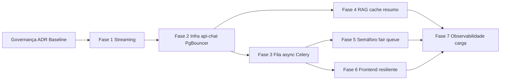

# Baseline e SLAs — Escala do Assistente Operoz

Documento de governança do epic **Escala do Chat**: metas quantitativas, baseline pós-implementação e validação reproduzível.

Relacionado: [ADR-004](./operis-assistant-adr-004-chat-scaling.md) · [assistant-scaling.md](./assistant-scaling.md)

## SLAs acordados (pós-escala)

| Métrica                   | Target              | Alerta (Fase 7)                        | Instrumentação                    |
| ------------------------- | ------------------- | -------------------------------------- | --------------------------------- |
| P95 first token           | &lt; 3000 ms        | `ASSISTANT_ALERT_P95_FIRST_TOKEN_MS`   | Redis samples + quality dashboard |
| P95 resposta completa     | &lt; 45 s           | —                                      | Teste de carga / APM              |
| Taxa de erro HTTP (chat)  | &lt; 5 %            | `ASSISTANT_ALERT_ERROR_RATE=0.05`      | `assistant_chat_error_rate`       |
| LLM paralelos (global)    | ≤ 40 (configurável) | semáforo                               | `assistant_llm_semaphore_*`       |
| Fila `assistant-chat`     | &lt; 100 jobs       | `ASSISTANT_CHAT_QUEUE_ALERT_THRESHOLD` | `check_celery_queues`             |
| Tempo máximo em fila (UX) | ~60 s com feedback  | UI `queue_update`                      | SSE + fair queue                  |

Metas de qualidade (programa): ver [assistant-quality-metrics.md](./assistant-quality-metrics.md).

## Baseline pós-implementação (2026-06-13)

Validação automatizada com LLM mockado (concorrência real, sem custo de provider):

```bash
docker compose -f docker-compose-local.yml exec api \
  python manage.py validate_assistant_scaling
```

### Resultado registado

| Métrica                   | Valor         | SLA          |
| ------------------------- | ------------- | ------------ |
| VUs simulados             | 150           | 150          |
| Taxa de sucesso           | 100 %         | ≥ 95 %       |
| Taxa de erro              | 0 %           | &lt; 5 %     |
| P95 first token           | ~500–1027 ms  | &lt; 3000 ms |
| P95 duração total         | ~1111–2262 ms | &lt; 45 s    |
| Wall time (150 chats)     | ~5–6 s        | —            |
| Testes pytest (assistant) | 104 passed    | 0 failed     |
| Filas Celery              | 0 em todas    | &lt; limiar  |
| Alertas operacionais      | nenhum        | —            |

**Nota:** baseline com mock valida arquitectura (concorrência, fila, semáforo, persistência). Baseline com **LLM real** em staging: script k6 em [tests/load/](../tests/load/README.md).

## Scripts versionados

| Artefacto              | Caminho                                                       |
| ---------------------- | ------------------------------------------------------------- |
| Validação completa     | `operis/db/management/commands/validate_assistant_scaling.py` |
| Carga 150 VUs (pytest) | `operis/tests/unit/assistant/test_scaling_validation.py`      |
| Carga k6 (staging)     | `tests/load/assistant-chat-scaling.k6.js`                     |

## Matriz de dependências entre fases



**Caminho crítico:** baseline → SSE token-a-token → api-chat → PgBouncer → fila Celery → semáforo LLM → teste 150 VUs → alertas.

**Paralelizável:** Fase 4 (RAG) após Fase 2; Fase 6 (FE) após Fase 3.

## Comparação antes / depois (qualitativa)

| Aspecto                     | Antes                      | Depois                         |
| --------------------------- | -------------------------- | ------------------------------ |
| Workers bloqueados por chat | Sim (api único)            | Não (worker Celery + api-chat) |
| Streaming SSE               | Bufferizado                | Token-a-token                  |
| Capacidade LLM              | Ilimitada (risco provider) | Semáforo 40 + fair queue       |
| CRUD sob pico chat          | Degradava                  | Isolado em `api`               |
| Observabilidade             | Logs apenas                | Prometheus + alertas + runbook |

## Próximos passos operacionais

1. Executar k6 em staging com `LLM_API_KEY` real antes de go-live cliente
2. Preencher [assistant-go-live-checklist.md](./assistant-go-live-checklist.md)
3. Configurar scrape Grafana em `/api/assistant/ops/metrics/`
