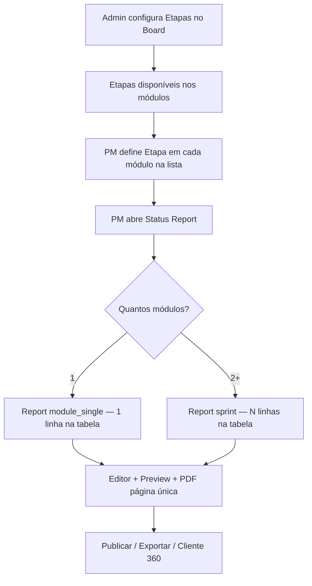

# Operoz — Etapa de Módulo + Status Report por Sprint (multi-módulo)

**Status:** proposta de produto / especificação  
**Data:** 2026-06-23  
**Relacionado:** Status Report (schema v2), lista de módulos, configurações do board

---

## 1. Contexto

### 1.1 Situação atual

**Lista de módulos** (`ModuleListHeader` / `ModuleListItemAction`):

| Coluna      | Campo / origem                          | Editável inline |
| ----------- | --------------------------------------- | --------------- |
| Módulo      | `name`, progresso, ícone de status      | Navegação       |
| Datas       | `start_date`, `target_date`             | Sim             |
| Status      | `status` (enum fixo: backlog, planned…) | Sim (dropdown)  |
| Responsável | `lead_id`                               | Indireto        |
| Ação        | favorito + menu ⋮                       | Sim             |

O **status** do módulo usa opções **globais** em `@operis/constants` (`MODULE_STATUS`). Não há campo de **etapa** no modelo `Module` nem coluna correspondente na UI.

**Status Report** (por projeto):

- Criação via modal com **um único módulo** (`module_id` obrigatório no `ProjectStatusReportCreateSerializer`).
- Modelo `BoardStatusReport` tem FK `module` (1:1 por report).
- Conteúdo JSON (`schema_version: 2`) gera secções para **um módulo**: `module`, `report_row`, `progress`, `entregas`, `observacoes`.
- Export PDF/HTML estilo Magalu/Allianz já existe (`status_report_export.py`).
- **Entregas** hoje são linhas **agregadas por etapa** (derivadas de labels/título dos cards via `DEFAULT_ETAPAS` hardcoded), não linhas por item de trabalho como no print de referência «Entregas da sprint».

### 1.2 Problema de negócio

1. O time precisa de uma dimensão **Etapa** nos módulos — distinta do **Status** — com vocabulário **por board/cliente** (ex.: Imersão, Homologação externa, Operação assistida).
2. O report semanal de sprint deve poder **agrupar vários módulos** num **único documento** (como o PDF «Sprint 3»): cada módulo selecionado vira **uma linha** na tabela «Entregas da sprint», e a coluna **Etapa atual** mostra o campo **Etapa** desse módulo.

### 1.3 Objetivos

| #   | Objetivo                                                                                                                                                              |
| --- | --------------------------------------------------------------------------------------------------------------------------------------------------------------------- |
| O1  | Nova coluna **Etapa** na lista de módulos, editável inline (pílula/badge como Status).                                                                                |
| O2  | Opções de etapa **configuráveis nas settings do board** (nome, cor, ordem, ativo/inativo).                                                                            |
| O3  | Status Report **multi-módulo** na criação (seleção múltipla).                                                                                                         |
| O4  | **Dois modos automáticos** conforme quantidade de módulos selecionados (ver §3.0).                                                                                    |
| O5  | **Sprint (2+ módulos):** linha = módulo; **Etapa atual** = campo Etapa do módulo. **Módulo único:** linha = card principal do cronograma; etapas derivadas dos cards. |

### 1.4 Fora de escopo (v1 desta feature)

- Templates customizáveis de report (ver `tech4humans-board-config-mvp3-plano.md` §10.8).
- Email automático do report.
- Etapa configurável **por card** (issue) — continua regra atual de labels/título; etapa de **módulo** é campo novo.
- Migração automática de reports antigos para schema v3 (apenas compatibilidade de leitura).

---

## 2. Parte A — Campo Etapa no módulo

### 2.1 Conceito: Status vs Etapa

| Dimensão       | Status (existente)                  | Etapa (novo)                                   |
| -------------- | ----------------------------------- | ---------------------------------------------- |
| Propósito      | Ciclo de vida operacional do módulo | Fase do cronograma / metodologia do cliente    |
| Opções         | Fixas no produto (`MODULE_STATUS`)  | **Customizáveis por board**                    |
| Exemplo        | Planejado, Em progresso, Concluído  | Imersão, Deploy, Operação assistida            |
| Onde configura | —                                   | **Board → Configurações → Módulos → Etapas**   |
| Onde aparece   | Lista, filtros, Cliente 360         | Lista, **coluna Etapa atual no Status Report** |

### 2.2 Modelo de dados (API)

#### Nova entidade: `BoardModuleStage`

| Campo                       | Tipo       | Notas                              |
| --------------------------- | ---------- | ---------------------------------- |
| `id`                        | UUID       | PK                                 |
| `board_id`                  | FK → Board | Escopo da configuração             |
| `name`                      | string(64) | Ex.: «Homologação externa»         |
| `slug`                      | string(64) | Único por board; usado em API      |
| `color`                     | string(7)  | Hex semântico ou token (`#00b8a9`) |
| `sort_order`                | float      | Ordem na lista e no report         |
| `is_default`                | bool       | Pré-selecionado em módulos novos   |
| `is_active`                 | bool       | Oculto em dropdown se inativo      |
| `created_at` / `updated_at` | datetime   | Auditoria                          |

**Seed por board (opcional na criação):** copiar `DEFAULT_ETAPAS` de `status_report_export.py` como etapas iniciais editáveis.

#### Alteração em `Module`

```python
stage = models.ForeignKey(
    "BoardModuleStage",
    on_delete=models.SET_NULL,
    null=True,
    blank=True,
    related_name="modules",
)
# stage_id denormalizado opcional para performance em listagens
```

> **Nota:** `stage` referencia config do **board** do projeto (`project.board_id`). Validação na API: stage deve pertencer ao mesmo board do projeto do módulo.

### 2.3 API

| Método | Path                                  | Descrição                   |
| ------ | ------------------------------------- | --------------------------- |
| GET    | `…/boards/{slug}/module-stages/`      | Lista etapas do board       |
| POST   | `…/boards/{slug}/module-stages/`      | Criar etapa (ADMIN)         |
| PATCH  | `…/boards/{slug}/module-stages/{id}/` | Editar nome/cor/ordem/ativo |
| DELETE | `…/boards/{slug}/module-stages/{id}/` | Soft delete ou desativar    |
| PATCH  | `…/projects/{id}/modules/{id}/`       | Aceitar `stage_id`          |

**Regras:**

- Mínimo 0 etapas configuradas → coluna Etapa mostra «—» ou «Sem etapa».
- Reordenar via `sort_order` (drag na settings).
- Ao desativar etapa em uso: módulos mantêm valor até o utilizador alterar (com badge «legado» na settings).

### 2.4 UI — Configurações do board

**Rota sugerida:** `/{workspaceSlug}/boards/{boardSlug}/settings/modules` (tab **Etapas**)

Padrão visual: reutilizar UX de **Estados do projeto** ou **Tipos de card** — lista densa, cor, nome, ordem, toggle ativo.

| Ação                | Comportamento                         |
| ------------------- | ------------------------------------- |
| Adicionar etapa     | Modal inline: nome + cor              |
| Editar              | Inline ou modal                       |
| Reordenar           | Drag handle                           |
| Duplicar board seed | Botão «Importar etapas padrão Operoz» |

Permissão: `boards.settings.manage` ou role equivalente no board.

### 2.5 UI — Lista de módulos

**Grid atual** (`module-list-header.tsx`):

```text
lg:grid-cols-[minmax(0,1fr)_10rem_7rem_2.5rem_3.5rem]
```

**Proposta:**

```text
lg:grid-cols-[minmax(0,1fr)_10rem_7rem_7rem_2.5rem_3.5rem]
                              ^datas ^status ^etapa ^lead ^ações
```

Novo componente: `ModuleStageDropdown` — espelho de `ModuleStatusDropdown`, opções vindas de `GET …/module-stages/`.

**Comportamento:**

- Pílula colorida com nome da etapa (tokens semânticos + cor configurada).
- Placeholder «Selecionar etapa» quando vazio.
- Respeitar `readOnly` / módulo arquivado (igual status).

### 2.6 Tipos TypeScript

```typescript
export interface IBoardModuleStage {
  id: string;
  board: string;
  name: string;
  slug: string;
  color: string;
  sort_order: number;
  is_default: boolean;
  is_active: boolean;
}

export interface IModule {
  // …existente
  stage_id: string | null;
  stage_detail?: IBoardModuleStage | null;
}
```

---

## 3. Parte B — Status Report (módulo único vs sprint)

### 3.0 Dois modos — regra automática

**Não há toggle na UI.** O tipo de report é inferido pela **quantidade de módulos** selecionados no modal:

| Seleção        | Modo                                | `report_kind`   | O que aparece na tabela                                                                    |
| -------------- | ----------------------------------- | --------------- | ------------------------------------------------------------------------------------------ |
| **1 módulo**   | Report de **módulo** (não é sprint) | `module_single` | **Cards principais** do cronograma desse módulo (1 linha = 1 card raiz / etapa de entrega) |
| **2+ módulos** | Report de **sprint**                | `sprint`        | **Módulos** selecionados (1 linha = 1 módulo)                                              |

```text
                    ┌─────────────────────────────────────┐
  module_ids.length │                                     │
        = 1         │  MÓDULO ÚNICO                       │
                    │  Tabela: cards do cronograma        │
                    │  Etapa = fase do card (label/título)│
                    └─────────────────────────────────────┘

                    ┌─────────────────────────────────────┐
  module_ids.length │                                     │
        ≥ 2         │  SPRINT                             │
                    │  Tabela: módulos selecionados       │
                    │  Etapa atual = campo Etapa (módulo) │
                    └─────────────────────────────────────┘
```

---

### 3.0.1 Modo módulo único (`module_single`)

Report focado **num módulo**. Comportamento próximo do v2 atual, evoluído para o layout do print.

```text
┌──────────────────────────────────────────────────────────────────────────┐
│ [Nome do módulo]              Report semanal · 13/04 a 17/04/2026        │
│ PRODUTO │ CONSULTOR │ RESP. CLIENTE │ INÍCIO │ FIM  (datas do módulo)   │
├──────────────────────────────────────────────────────────────────────────┤
│ Cronograma — Evolução do projeto ████████████ 75%                        │
├──────────────────────────────────────────────────────────────────────────┤
│ Entregas do projeto  (ou «Entregas da sprint» — copy i18n)               │
│ ┌──────────────────────┬────────┬───────────────┬────────────┬────────┐ │
│ │ ITEM (card principal)│ INÍCIO │ ENTREGA(ETAPA)│ ETAPA ATUAL│ % TOTAL  │ │
│ ├──────────────────────┼────────┼───────────────┼────────────┼────────┤ │
│ │ IBLBDM-52150 — …     │ 15/04  │ 17/04         │ Deploy     │ 100%     │ ← card
│ │ IBLBDM-52151 — …     │ …      │ …             │ Homolog.   │ 80%      │ ← card
│ └──────────────────────┴────────┴───────────────┴────────────┴────────┘ │
├──────────────────────────────────────────────────────────────────────────┤
│ Observações                                                              │
└──────────────────────────────────────────────────────────────────────────┘
```

| Coluna              | Origem (módulo único)                                                                             |
| ------------------- | ------------------------------------------------------------------------------------------------- |
| **ITEM**            | Card raiz do módulo: `{sequence_id} — {name}`                                                     |
| **INÍCIO**          | `issue.start_date`                                                                                |
| **ENTREGA (ETAPA)** | `issue.target_date`                                                                               |
| **ETAPA ATUAL**     | Etapa inferida do **card** (`_resolve_issue_etapa`: labels / título) — **não** usa `module.stage` |
| **% TOTAL DO ITEM** | % conclusão do card (+ sub-itens)                                                                 |

**Builder:** reutilizar `build_entregas_from_module_issues` / linhas por card raiz (evoluir de agregação pura por etapa para **1 linha por card principal**, se ainda não estiver assim).

**Cronograma:** barra = média do avanço das etapas/cards desse módulo (`progress_pct_from_entregas`).

---

### 3.0.2 Modo sprint (`sprint`) — print Sprint 3

Vários módulos num **único documento**. A tabela lista os **módulos**, não os cards internos.

```text
┌──────────────────────────────────────────────────────────────────────────┐
│ Sprint 3                          Report semanal · 13/04 a 17/04/2026    │
│ PRODUTO │ CONSULTOR │ RESP. CLIENTE │ INÍCIO │ FIM                       │
├──────────────────────────────────────────────────────────────────────────┤
│ Cronograma — Evolução da sprint ████████████████████ 100%                │
├──────────────────────────────────────────────────────────────────────────┤
│ Entregas da sprint                                                       │
│ ┌─────────┬─────────┬───────────────┬─────────────┬──────────────────┐   │
│ │ ITEM    │ INÍCIO  │ ENTREGA(ETAPA)│ ETAPA ATUAL │ % TOTAL DO ITEM  │   │
│ ├─────────┼─────────┼───────────────┼─────────────┼──────────────────┤   │
│ │ Módulo A│ 15/04   │ 17/04         │ Deploy      │ 100%             │ ← linha = módulo
│ │ Módulo B│ …       │ …             │ Homologação │ 80%              │ ← linha = módulo
│ │ Módulo C│ …       │ …             │ Imersão     │ 45%              │ ← linha = módulo
│ └─────────┴─────────┴───────────────┴─────────────┴──────────────────┘   │
│                              ▲                                           │
│                              └── coluna ETAPA ATUAL = campo Etapa do     │
│                                  módulo (BoardModuleStage)               │
├──────────────────────────────────────────────────────────────────────────┤
│ Observações (em execução · pontos de atenção · próximos passos)          │
└──────────────────────────────────────────────────────────────────────────┘
```

| Elemento no print          | Significado              | Origem no Operoz                                    |
| -------------------------- | ------------------------ | --------------------------------------------------- |
| Título «Sprint 3»          | Nome da sprint / report  | `title` (livre) ou label da sprint                  |
| Report semanal · datas     | Período do report        | `period_start` / `period_end`                       |
| PRODUTO / CONSULTOR / …    | Metadados do cabeçalho   | `report_row` (projeto + módulo principal ou sprint) |
| Barra «Evolução da sprint» | Progresso agregado       | Média do `%` dos módulos selecionados               |
| **Cada linha da tabela**   | **Um módulo** da seleção | `module_ids[]`                                      |
| Coluna **ITEM**            | Identificação do módulo  | `module.name` (+ indicador visual de status)        |
| Coluna **INÍCIO**          | Início do módulo         | `module.start_date`                                 |
| Coluna **ENTREGA (ETAPA)** | Fim previsto do módulo   | `module.target_date`                                |
| Coluna **ETAPA ATUAL**     | Fase metodológica atual  | **`module.stage.name`** (campo Etapa)               |
| Coluna **% TOTAL DO ITEM** | Avanço do módulo         | % issues concluídas no módulo (já existe na lista)  |
| Observações                | Texto da semana          | Global da sprint (editável no composer)             |

> **Sprint (2+ módulos):** coluna **Etapa atual** = campo **Etapa** do módulo. **Módulo único:** coluna **Etapa atual** = etapa inferida do **card** (labels/título).

### 3.1 Cenários de uso

**Módulo único:**

> Gero report da semana só do módulo «IBLBDM-52150 — Emissão manual». A tabela mostra os **cards principais** do cronograma (Imersão, Desenvolvimento, Deploy…) com datas e % de cada um.

**Sprint:**

> Seleciono os módulos A, B e C da **Sprint 3**. A tabela mostra **três linhas** (A, B, C), cada uma com **Etapa atual** = etapa que defini na lista de módulos.

### 3.2 UX — Criação do report

**Modal atual:** `ProjectStatusReportCreateModal` — `CustomSelect` single para módulo.

**Proposta:**

| Campo          | Antes                 | Depois                                                          |
| -------------- | --------------------- | --------------------------------------------------------------- |
| Módulo(s)      | Select único          | **Multi-select** (checkbox list ou combobox com chips)          |
| Título         | Auto = nome do módulo | 1 módulo → nome do módulo; 2+ → título livre (ex. «Sprint 3»)   |
| Tipo de report | Implícito (1 módulo)  | **Automático:** `len(module_ids) == 1` → módulo; `≥ 2` → sprint |

**Preview no modal (opcional):** hint «Report de módulo — cards do cronograma» vs «Report de sprint — N módulos» conforme a seleção.

**Validações:**

- Mínimo 1 módulo selecionado.
- Máximo sugerido: 10 módulos (performance PDF).
- Mesmo projeto (v1); multi-projeto fica para v2.

**Histórico / lista:**

- Coluna «Módulo» passa a «Módulo(s)»: «3 módulos» + tooltip com nomes.
- Filtro por módulo continua a funcionar (report aparece se incluir aquele módulo).

### 3.3 Modelo de dados

#### Opção recomendada: tabela de junção + FK principal nullable

```python
class BoardStatusReportModule(BaseModel):
    report = models.ForeignKey(BoardStatusReport, related_name="report_modules")
    module = models.ForeignKey(Module, related_name="status_report_links")
    sort_order = models.FloatField(default=0)

    class Meta:
        unique_together = [("report", "module")]
```

- `BoardStatusReport.module` (FK legada): preenchida com o **primeiro** módulo para compatibilidade com Cliente 360 / filtros existentes.
- Novos reports multi-módulo: `report_modules` é fonte de verdade.

#### API — create payload

```typescript
export type TProjectStatusReportCreateData = {
  period_start: string;
  period_end: string;
  title?: string;
  executive_summary_html?: string;
  module_ids: string[]; // substitui module_id singular (manter alias deprecated)
};
```

### 3.4 Conteúdo JSON — schema v3

Evolução de `TBoardStatusReportContent`. O report de sprint é **flat** (uma página), não array de blocos por módulo:

```typescript
export type TBoardStatusReportContent = {
  schema_version: 3;
  report_kind: "module_single" | "sprint";
  sections: {
    sprint?: { label: string; period_label: string };
    module?: { id: string; name: string; start_date?: string; target_date?: string };
    report_row?: { produto: string; consultor: string; responsavel_cliente: string; inicio: string; fim: string };
    progress?: { pct: number; omitir_global?: boolean };
    /** Sprint: 1 linha por módulo */
    entregas_sprint?: TStatusReportSprintModuleRow[];
    /** Módulo único: 1 linha por card principal do cronograma */
    entregas?: TStatusReportEntregaRow[];
    observacoes?: TStatusReportObservacoes;
    executive_summary?: { html?: string };
    metrics?: Record<string, unknown>;
  };
};

/** Sprint — linha = módulo */
export type TStatusReportSprintModuleRow = {
  module_id: string;
  item_label: string;
  data_inicio: string;
  data_entrega_etapa: string;
  etapa_atual: string; // module.stage.name
  etapa_color?: string | null;
  pct_total: string;
  sort_order: number;
};

/** Módulo único — linha = card principal (schema existente, evoluído) */
export type TStatusReportEntregaRow = {
  etapa: string; // coluna ETAPA / nome da fase do card
  issue_id?: string;
  item_label?: string; // sequence + name (coluna ITEM)
  data_inicio: string;
  data_entrega: string;
  etapa_atual?: string; // _resolve_issue_etapa(issue)
  pct: string;
  mostrar_pct?: boolean;
};
```

**Regras de escrita:**

| `report_kind`   | Secção preenchida             | Secção vazia            |
| --------------- | ----------------------------- | ----------------------- |
| `module_single` | `entregas[]` (cards)          | `entregas_sprint`       |
| `sprint`        | `entregas_sprint[]` (módulos) | `entregas` (ou omitido) |

**Compatibilidade v2:** leitura inalterada; novos reports usam v3 com uma das duas secções.

### 3.5 Builders — mapeamento por modo

#### Sprint (`entregas_sprint[]`)

| Coluna PDF      | Origem                  |
| --------------- | ----------------------- |
| ITEM            | `module.name`           |
| INÍCIO          | `module.start_date`     |
| ENTREGA (ETAPA) | `module.target_date`    |
| ETAPA ATUAL     | **`module.stage.name`** |
| % TOTAL         | % conclusão do módulo   |

#### Módulo único (`entregas[]`)

| Coluna PDF      | Origem                                              |
| --------------- | --------------------------------------------------- |
| ITEM            | Card raiz: `{sequence_id} — {name}`                 |
| INÍCIO          | `issue.start_date`                                  |
| ENTREGA (ETAPA) | `issue.target_date`                                 |
| ETAPA ATUAL     | **`_resolve_issue_etapa(issue)`** (labels / título) |
| % TOTAL         | % do card + sub-itens                               |

```python
def build_status_report_content(..., module_ids: list[UUID]) -> dict:
    modules = fetch_modules(module_ids)
    if len(modules) == 1:
        module = modules[0]
        issue_qs = _project_module_issues_queryset(...)
        entregas = build_entregas_from_module_root_issues(issue_qs)  # 1 linha/card
        return {
            "schema_version": 3,
            "report_kind": "module_single",
            "sections": {
                "module": {...},
                "entregas": entregas,
                "progress": {"pct": progress_pct_from_entregas(entregas)},
                ...
            },
        }
    rows = [build_sprint_module_row(m, m.stage) for m in modules]
    return {
        "schema_version": 3,
        "report_kind": "sprint",
        "sections": {
            "entregas_sprint": rows,
            "progress": {"pct": average([r["pct_total"] for r in rows])},
            ...
        },
    }
```

### 3.6 Layout PDF/HTML (sprint — página única)

```text
┌─────────────────────────────────────────────┐
│ [Logo]              Sprint 3                │
│ Report semanal · 13/04 a 17/04/2026         │
│ PRODUTO │ CONSULTOR │ RESP. │ INÍCIO │ FIM  │
├─────────────────────────────────────────────┤
│ Cronograma — Evolução da sprint [====] 100% │
├─────────────────────────────────────────────┤
│ Entregas da sprint                          │
│  (tabela: N linhas = N módulos selecionados)│
├─────────────────────────────────────────────┤
│ Observações                                 │
│  Em execução / Pontos de atenção / …        │
└─────────────────────────────────────────────┘
```

- **Sem** repetir cabeçalho/cronograma por módulo.
- Ordem das linhas: `sort_order` do módulo ou ordem de seleção no modal.
- Export: estender `content_to_html` para renderizar `entregas_sprint` com as 5 colunas do print.

### 3.7 Backend — geração de conteúdo

```python
def build_project_sprint_status_report_content(
    *,
    project: Project,
    modules: list[Module],
    user: User,
    workspace_slug: str,
    period_start: date,
    period_end: date,
    title: str | None = None,
) -> dict:
    rows = []
    pcts = []
    for module in modules:
        stage = module.stage  # select_related
        row = build_sprint_module_row(module, stage)
        rows.append(row)
        pcts.append(int(row["pct_total"]))

    avg_pct = round(sum(pcts) / len(pcts)) if pcts else 0

    return {
        "schema_version": 3,
        "report_kind": "sprint" if len(modules) > 1 else "module_single",
        "sections": {
            "sprint": {
                "label": title or f"Report · {period_start}",
                "period_label": f"{period_start:%d/%m/%Y} a {period_end:%d/%m/%Y}",
            },
            "report_row": _build_report_row(project, modules, user),
            "progress": {"pct": avg_pct},
            "entregas_sprint": sorted(rows, key=lambda r: r["sort_order"]),
            "observacoes": default_observacoes_block(),
            "executive_summary": {"html": ""},
        },
    }
```

Endpoint `POST …/projects/{id}/status-reports/` passa a aceitar `module_ids: UUID[]` (mín. 1).

---

## 4. Fluxo end-to-end



---

## 5. Plano de implementação (fases)

| Fase  | Entregável                                                       | Estimativa | Dependências |
| ----- | ---------------------------------------------------------------- | ---------- | ------------ |
| **1** | Modelo `BoardModuleStage` + CRUD API + migration                 | 3–4 d      | —            |
| **2** | Settings board «Etapas de módulo» + seed DEFAULT_ETAPAS          | 3–4 d      | Fase 1       |
| **3** | Coluna Etapa na lista + PATCH módulo                             | 2 d        | Fase 1       |
| **4** | `module_ids[]` no create + junction table                        | 2–3 d      | —            |
| **5** | Builder v3: `entregas_sprint[]` (1 linha/módulo) + `etapa_atual` | 3–4 d      | Fase 3–4     |
| **6** | Modal multi-select + preview tabela sprint                       | 3–4 d      | Fase 5       |
| **7** | Export PDF/HTML — layout print (5 colunas)                       | 3 d        | Fase 5       |
| **8** | Cliente 360 + histórico (labels «N módulos»)                     | 2 d        | Fase 4       |
| **9** | Testes + i18n pt-BR/en                                           | 2 d        | Todas        |

**Total indicativo:** 4–6 semanas (1 dev full-stack), com validação visual após Fase 3 e Fase 7.

Ordem sugerida: **1 → 2 → 3** (Etapa) em paralelo com **4 → 5** (API report), depois **6 → 7** (UI + PDF).

---

## 6. Critérios de aceite

### Etapa de módulo

- [ ] ADMIN cria/edita/reordena etapas nas settings do board.
- [ ] MEMBER altera etapa de um módulo na lista (inline dropdown).
- [ ] Etapa persiste após refresh; cor e nome refletem a config do board.
- [ ] Módulo sem etapa não bloqueia fluxo (estado vazio explícito).

### Status Report

- [ ] **1 módulo** → `module_single`; tabela com **cards principais**; etapa do **card**.
- [ ] **2+ módulos** → `sprint`; tabela com **módulos**; **Etapa atual** = campo **Etapa** do módulo.
- [ ] Transição automática ao alterar seleção no modal (sem toggle manual).
- [ ] Reports v2 continuam a abrir.

---

## 7. Impacto em ficheiros (referência técnica)

| Área         | Ficheiros principais                                                                                                    |
| ------------ | ----------------------------------------------------------------------------------------------------------------------- |
| API models   | `module.py`, novo `board_module_stage.py`, `board_status_report.py`                                                     |
| API views    | `status_reports.py`, novo `module_stages.py`                                                                            |
| Builders     | `board_status_report.py`, `status_report_export.py`                                                                     |
| Web módulos  | `module-list-header.tsx`, `module-list-item-action.tsx`, novo `module-stage-dropdown.tsx`                               |
| Web settings | `settings/board/…` (nova tab Etapas)                                                                                    |
| Web report   | `project-status-report-create-modal.tsx`, `project-status-report-detail.tsx`, `project-status-report-preview-panel.tsx` |
| Types        | `packages/types` — `IModule`, `IBoardModuleStage`, `TBoardStatusReportContent` v3                                       |
| i18n         | `project_modules.list.col_stage`, `boards.settings.module_stages.*`, `project.status_report.multi_module.*`             |

---

## 8. Decisões em aberto

| #   | Pergunta                                                        | Opções                            | Recomendação                                                  |
| --- | --------------------------------------------------------------- | --------------------------------- | ------------------------------------------------------------- |
| D1  | Etapa obrigatória em módulos novos?                             | Sim / Não                         | **Não** (opcional; default se `is_default`)                   |
| D2  | Um report por semana **por conjunto** de módulos ou por módulo? | Conjunto / Individual             | **Conjunto** para sprint; duplicar report continua por módulo |
| D3  | Título auto da sprint                                           | Nome livre / «Sprint N» / data    | **Livre** + sugestão «Report · {semana}»                      |
| D4  | `DEFAULT_ETAPAS` hardcoded                                      | Manter fallback / só board config | **Board config** com seed inicial editável                    |
| D5  | Observações                                                     | Global da sprint / Por linha      | **Global** (como print)                                       |

---

## 9. Referências visuais

- **Lista de módulos:** coluna **Etapa** (campo novo) — usada no report **sprint**.
- **Report módulo único:** linhas = cards do cronograma; etapa inferida do card.
- **Report sprint (print Sprint 3):** linhas = módulos; coluna **Etapa atual** = campo **Etapa** do módulo.

---

## 10. Próximo passo

1. Validar decisões **D1–D5** com produto.
2. Aprovar fases **1–3** (Etapa) como entrega independente do multi-módulo.
3. Após aprovação: abrir issues/PRs por fase conforme `operis-gap-tracker.md`.
