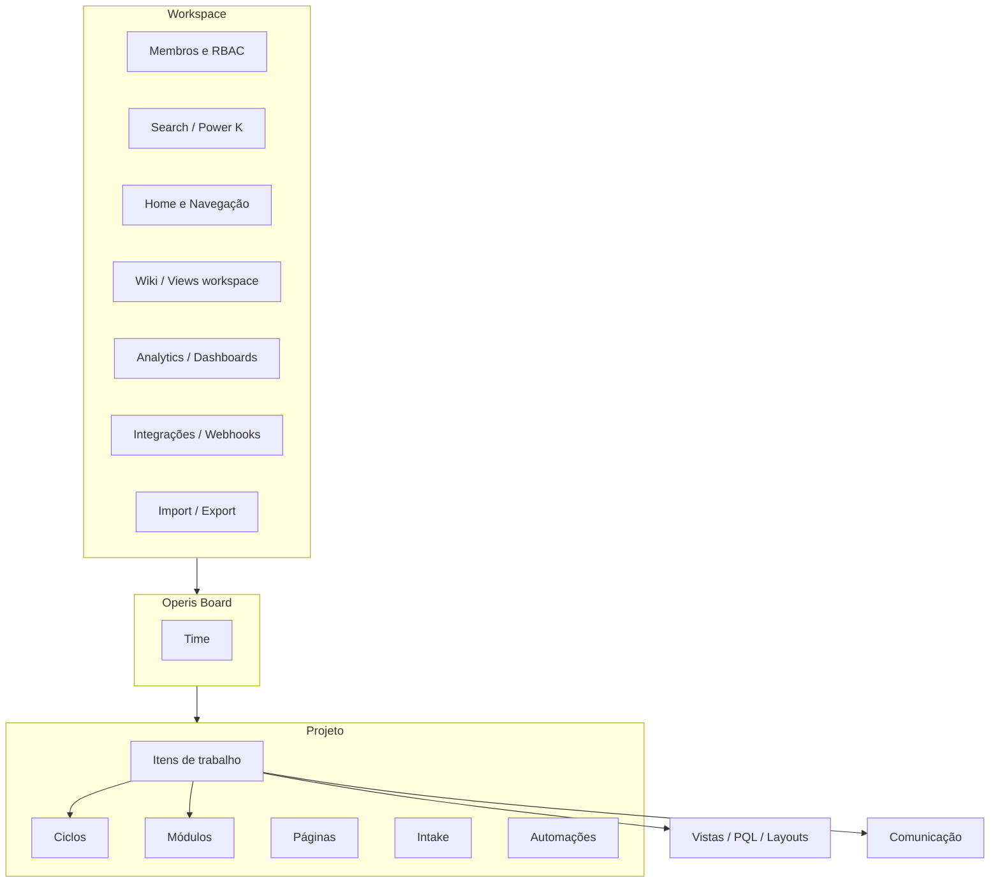

# Operis × Plane — Catálogo completo da documentação (sidebar)

> **Resposta direta:** o ficheiro anterior ([operis-workspace-mvp-plane.md](./operis-workspace-mvp-plane.md)) cobriu sobretudo **Gestão do espaço de trabalho** e recursos transversais (membros, RBAC, search, home). **Não** percorreu página a página as outras 11 secções da sidebar. Este documento corrige isso: inventário **por secção**, com link oficial, resumo funcional e estado no **Operis**.

**Fonte:** [docs.plane.so](https://docs.plane.so/) (estrutura da sidebar em PT, como na captura).  
**Última atualização:** junho/2026.

---

## Índice (espelha a sidebar Plane)

| #   | Secção sidebar (PT)                                             | Secção EN (doc)                           |
| --- | --------------------------------------------------------------- | ----------------------------------------- |
| 1   | [Gestão do espaço de trabalho](#1-gestão-do-espaço-de-trabalho) | Workspace management                      |
| 2   | [Gerenciamento de projetos](#2-gerenciamento-de-projetos)       | Project management                        |
| 3   | [Gestão de itens de trabalho](#3-gestão-de-itens-de-trabalho)   | Work item management                      |
| 4   | [Planejamento e organização](#4-planejamento-e-organização)     | Planning and organization                 |
| 5   | [Vistas e layouts](#5-vistas-e-layouts)                         | Views and layouts                         |
| 6   | [Gestão do conhecimento](#6-gestão-do-conhecimento)             | Knowledge management                      |
| 7   | [Gestão avançada](#7-gestão-avançada)                           | Advanced management                       |
| 8   | [Comunicação](#8-comunicação)                                   | Communication                             |
| 9   | [Admissão e clientes](#9-admissão-e-clientes)                   | Intake and customers                      |
| 10  | [Análises e relatórios](#10-análises-e-relatórios)              | Analytics and reporting _(sidebar extra)_ |
| 11  | [Integrações](#11-integrações)                                  | Integrations                              |
| 12  | [Importação e exportação](#12-importação-e-exportação)          | Import and export                         |
| 13  | [IA](#13-ia)                                                    | AI                                        |

Legenda **Operis:**

| Tag | Significado                                                |
| --- | ---------------------------------------------------------- |
| ✅  | Existe no fork (validar UX/copy PT)                        |
| 🟡  | Parcial ou só CE / plano pago no Plane                     |
| 🔜  | Planeado Tech4Humans (Boards, etc.)                        |
| ❌  | Não existe ou fora de escopo                               |
| 🔄  | Operis tem equivalente diferente (ex.: Board vs Teamspace) |

---

## 1. Gestão do espaço de trabalho

| Página doc                            | URL                                                                                         | O que faz                                                   | Operis                      |
| ------------------------------------- | ------------------------------------------------------------------------------------------- | ----------------------------------------------------------- | --------------------------- |
| Gerenciar espaço de trabalho          | [overview](https://docs.plane.so/core-concepts/workspaces/overview)                         | Criar, convites, alternar, settings, apagar workspace       | ✅                          |
| Gerenciar membros                     | [members](https://docs.plane.so/core-concepts/workspaces/members)                           | Convidar email, CSV, alterar papel, remover, sair, activity | ✅ CSV 🟡                   |
| Pesquisar workspace                   | [search](https://docs.plane.so/workspaces-and-users/search-workspace)                       | Ctrl+K, abas por tipo, permissões                           | ✅                          |
| Personalizar página inicial           | [homepage](https://docs.plane.so/core-concepts/account/overview)                            | Widgets home, quick links, recents, stickies                | ✅                          |
| Power K                               | [power-k](https://docs.plane.so/core-concepts/power-k)                                      | Paleta: search, criar, settings, atalhos                    | ✅ 🟡                       |
| Personalizar navegação                | [navigation](https://docs.plane.so/workspaces-and-users/customize-navigation)               | Sidebar itens, accordion/tabs, limite projetos              | ✅                          |
| Papéis e permissões (visão geral)     | [roles overview](https://docs.plane.so/roles-and-permissions/overview)                      | RBAC + GAC, scopes, herança                                 | ✅ RBAC; GAC 🟡 CE          |
| Papéis de membros                     | [member-roles](https://docs.plane.so/roles-and-permissions/member-roles)                    | Owner, Admin, Member, Guest + projeto                       | 🟡 sem Owner role explícito |
| Matriz de permissões                  | [matrix](https://docs.plane.so/roles-and-permissions/permissions-matrix)                    | Tabela exaustiva workspace/projeto/wiki/…                   | ✅ lógica; doc CE parcial   |
| Esquemas de permissão / papéis custom | [permission schemes](https://docs.plane.so/roles-and-permissions/create-permission-schemes) | Enterprise GAC                                              | 🟡 CE                       |
| SSO                                   | [sso](https://docs.plane.so/authentication/sso)                                             | OIDC, SAML, domínios                                        | 🟡                          |
| Faturação e planos                    | [billing](https://docs.plane.so/workspaces-and-users/billing-and-plans)                     | Stripe, lugares, Guest grátis                               | ❌ cloud / N/A self-host    |
| IdP Group Sync                        | doc authentication                                                                          | Sync grupos IdP → membros                                   | 🟡 CE                       |

**MVP Operis (esta secção):** ver [operis-workspace-mvp-plane.md](./operis-workspace-mvp-plane.md) — épicos A–E.

---

## 2. Gerenciamento de projetos

| Página doc                   | URL                                                                                           | O que faz                                            | Operis       |
| ---------------------------- | --------------------------------------------------------------------------------------------- | ---------------------------------------------------- | ------------ |
| Gerenciar projetos           | [projects](https://docs.plane.so/core-concepts/projects/overview)                             | CRUD projeto, identificador, features, arquivo       | ✅           |
| Gerenciar membros do projeto | [manage-project-members](https://docs.plane.so/core-concepts/projects/manage-project-members) | Admin, Contributor, Commenter, Guest; teamspace link | ✅           |
| Publicar projetos            | publish docs                                                                                  | Projeto público / Space deploy                       | ✅ Space app |
| Estados do projeto           | project states                                                                                | Grupos de estado por projeto                         | ✅           |
| Etiquetas do projeto         | project labels                                                                                | Labels partilhadas no projeto                        | ✅           |
| Visão geral do projeto       | project overview                                                                              | Dashboard resumo do projeto                          | ✅ 🟡        |
| Modelos de projeto           | project templates                                                                             | Criar projeto a partir de template                   | 🟡           |

**Operis específico:** projeto = **épico de negócio**; agrupado sob **Board** na sidebar — [tech4humans-boards-plano-desenvolvimento.md](./tech4humans-boards-plano-desenvolvimento.md).

---

## 3. Gestão de itens de trabalho

| Página doc                                  | URL                                                                    | O que faz                                                  | Operis                                    |
| ------------------------------------------- | ---------------------------------------------------------------------- | ---------------------------------------------------------- | ----------------------------------------- |
| Gerenciar itens de trabalho                 | [issues overview](https://docs.plane.so/core-concepts/issues/overview) | CRUD, detalhe (peek/modal/full), histórico, arquivo        | ✅                                        |
| Propriedades do item                        | properties                                                             | Estado, prioridade, datas, assignees, labels, estimate     | ✅                                        |
| Criar via URL                               | create via URL                                                         | Deep link cria item com params                             | 🟡                                        |
| Guardar rascunhos                           | draft work items                                                       | Rascunhos antes de publicar                                | ✅ workspace drafts                       |
| Tipos por projeto                           | project work item types                                                | Task, Epic, Bug, custom, hierarquia                        | 🟡                                        |
| Tipos por workspace                         | workspace work item types                                              | Tipos reutilizáveis                                        | 🟡                                        |
| Estados dos itens                           | work item states                                                       | Workflow por projeto                                       | ✅                                        |
| Etiquetas dos itens                         | labels                                                                 | Tags nos itens                                             | ✅                                        |
| Modelos de itens                            | templates                                                              | Template de criação                                        | 🟡                                        |
| Itens recorrentes                           | recurring                                                              | Repetição automática                                       | 🟡 CE                                     |
| Épicos                                      | [epics](https://docs.plane.so/core-concepts/issues/epics)              | Epic = tipo de item (não aba separada); hierarquia nível 1 | ✅ tipo; no Operis épico = **Projeto** 🔄 |
| Sub-itens                                   | parent/child                                                           | Subtarefas aninhadas                                       | ✅                                        |
| Relações custom                             | custom relations                                                       | Bloqueia, relacionado, duplicado                           | 🟡                                        |
| Atualizações de status (On track / At risk) | work item updates                                                      | Saúde do item                                              | 🟡                                        |

**Hierarquia Tech4Humans:** Card = `Issue`; Subtarefa = `Issue` com `parent`; não confundir Epic Plane com Projeto Operis.

---

## 4. Planejamento e organização

| Página doc                     | URL                                                                     | O que faz                                               | Operis              |
| ------------------------------ | ----------------------------------------------------------------------- | ------------------------------------------------------- | ------------------- |
| Ciclos                         | [cycles](https://docs.plane.so/core-concepts/cycles)                    | Sprints; auto-schedule, rollover, overview workspace    | ✅                  |
| Módulos                        | [modules](https://docs.plane.so/core-concepts/modules)                  | Marcos/features; estados; layouts list/gallery/timeline | ✅                  |
| Épicos                         | [epics](https://docs.plane.so/core-concepts/issues/epics)               | Ver secção 3 — tipo de item                             | 🔄                  |
| Dependências na timeline       | timeline dependencies                                                   | Gantt com dependências                                  | 🟡                  |
| Iniciativas                    | [initiatives](https://docs.plane.so/core-concepts/projects/initiatives) | Metas multi-projeto; overview/scope; board/timeline     | 🟡 CE               |
| Espaços de equipe (Teamspaces) | [teamspaces](https://docs.plane.so/core-concepts/workspaces/teamspaces) | Hub do time: itens/ciclos/views cross-project           | 🔄 **Board** Operis |
| Conquistas (Milestones)        | milestones                                                              | Alvo de data em itens                                   | 🟡                  |
| Lançamentos (Releases)         | releases                                                                | Versões, changelog, itens ligados                       | 🟡 CE               |
| Post-its (Stickies)            | [stickies](https://docs.plane.so/core-concepts/stickies)                | Notas flutuantes pessoais                               | ✅                  |

**Board Operis (MVP):** substitui Teamspace para “time → N projetos”; ver docs `tech4humans-boards-*`.

---

## 5. Vistas e layouts

| Página doc                  | URL                                                                    | O que faz                                       | Operis            |
| --------------------------- | ---------------------------------------------------------------------- | ----------------------------------------------- | ----------------- |
| Layouts                     | [layouts](https://docs.plane.so/core-concepts/issues/layouts)          | Lista, Board, Calendário, Tabela, Timeline      | ✅                |
| Filtros de itens            | filters                                                                | Filtros ricos, guardar                          | ✅ `rich_filters` |
| Linguagem de consulta (PQL) | [PQL](https://docs.plane.so/core-concepts/issues/plane-query-language) | Query texto: `isOverdue`, milestones, IN/NOT IN | 🟡                |
| Opções de exibição          | display options                                                        | Group by, order, colunas                        | ✅                |
| Vistas                      | views                                                                  | Vistas guardadas projeto + workspace            | ✅                |
| Seu trabalho (Your Work)    | your work                                                              | Itens atribuídos cross-project                  | ✅                |

**Board hub (Operis MVP-2):** vistas agregadas Lista/Backlog/Quadro no **Board** — [tech4humans-boards-mvp2-plano.md](./tech4humans-boards-mvp2-plano.md).

---

## 6. Gestão do conhecimento

| Página doc          | URL                                                    | O que faz                                                           | Operis            |
| ------------------- | ------------------------------------------------------ | ------------------------------------------------------------------- | ----------------- |
| Páginas do projeto  | project pages                                          | Docs por projeto; editor blocos                                     | ✅                |
| Blocos do editor    | editor blocks                                          | Conteúdo rico embutido                                              | ✅ package editor |
| Página de relatório | report page                                            | Relatórios em página                                                | 🟡                |
| Wiki                | [wiki](https://docs.plane.so/core-concepts/pages/wiki) | Base conhecimento workspace: collections, shared, private, archived | ✅ 🟡             |
| Coleções            | collections                                            | Pastas de páginas wiki                                              | 🟡                |
| Páginas aninhadas   | nested pages                                           | Hierarquia de páginas                                               | ✅                |
| Modelos de página   | page templates                                         | Templates wiki/página                                               | 🟡                |
| Draw.io em páginas  | integrations draw.io                                   | Diagramas embutidos                                                 | 🟡                |

---

## 7. Gestão avançada

| Página doc                      | URL                                                                       | O que faz                                            | Operis                                                                  |
| ------------------------------- | ------------------------------------------------------------------------- | ---------------------------------------------------- | ----------------------------------------------------------------------- |
| Estimativas                     | estimates                                                                 | Pontos/tamanho por projeto                           | ✅                                                                      |
| Operações em massa              | [bulk-ops](https://docs.plane.so/core-concepts/issues/bulk-ops)           | Editar/arquivar/apagar vários (lista/tabela)         | ✅                                                                      |
| Controle de tempo               | [time-tracking](https://docs.plane.so/core-concepts/issues/time-tracking) | Log horas; worklogs workspace export CSV/Excel       | ✅                                                                      |
| Fluxos de trabalho e aprovações | [workflows](https://docs.plane.so/workflows-and-approvals/workflows)      | Transições, aprovações, scripts pre/post             | 🟡 CE                                                                   |
| Relações customizadas           | custom relations                                                          | Tipos de link entre itens                            | 🟡                                                                      |
| Automações (default)            | [automations](https://docs.plane.so/automations/overview)                 | Auto-arquivar, auto-fechar stale, lembretes due date | ✅ 🟡                                                                   |
| Automações custom               | custom automations                                                        | Trigger + condição + ação                            | 🟡 — ver [operis-automacao-mvp-spec.md](./operis-automacao-mvp-spec.md) |
| Plane Runner                    | [plane-runner](https://docs.plane.so/automations/plane-runner)            | JS/TS sandbox em eventos e workflows                 | 🟡 CE                                                                   |

---

## 8. Comunicação

| Página doc                    | URL                                                                                  | O que faz                                    | Operis           |
| ----------------------------- | ------------------------------------------------------------------------------------ | -------------------------------------------- | ---------------- |
| Atualizações do projeto       | project updates                                                                      | Status reports do projeto                    | ✅ status report |
| Comentários em itens          | work item comments                                                                   | Thread, menções, reações                     | ✅               |
| Comentários inline em páginas | page inline comments                                                                 | Comentários em docs                          | 🟡               |
| Subscritores                  | subscribers                                                                          | Seguir item e receber notificações           | ✅               |
| Notificações                  | [notifications](https://docs.plane.so/communication-and-collaboration/notifications) | Inbox, email batch 5 min, push, preferências | ✅               |
| Caixa de entrada (Inbox)      | inbox                                                                                | Centro de notificações                       | ✅               |

**Operis:** flags extra em `Workspace` para email de issues (`issue_notify_*` em `workspace.py`).

---

## 9. Admissão e clientes

| Página doc              | URL                                                       | O que faz                                         | Operis            |
| ----------------------- | --------------------------------------------------------- | ------------------------------------------------- | ----------------- |
| Visão geral Intake      | [intake overview](https://docs.plane.so/intake/overview)  | Triagem antes do workflow; estado Triage          | ✅ feature toggle |
| Intake na app           | [intake](https://docs.plane.so/core-concepts/intake)      | Guest cria; admin aceita/rejeita/snooze/duplicado | ✅                |
| Formulários Intake      | [intake-forms](https://docs.plane.so/intake/intake-forms) | Form público URL; custom por work item type       | ✅ 🟡             |
| Intake por email        | intake email                                              | Email → item triagem                              | 🟡                |
| Responsável pelo intake | intake responsible                                        | Auto-assign + notificação                         | 🟡                |
| Clientes (Customers)    | customers                                                 | Registo cliente ligado a itens                    | 🟡 CE             |

---

## 10. Análises e relatórios

_(Presente na sidebar completa da doc; não estava na captura cortada.)_

| Página doc | URL                                                        | O que faz                                                             | Operis |
| ---------- | ---------------------------------------------------------- | --------------------------------------------------------------------- | ------ |
| Analytics  | [analytics](https://docs.plane.so/core-concepts/analytics) | Métricas workspace: utilizadores, projetos, ciclos, módulos, gráficos | ✅     |
| Dashboards | [dashboards](https://docs.plane.so/dashboards)             | Widgets custom cross-project, PQL, 7 tipos gráfico                    | 🟡 CE  |

---

## 11. Integrações

| Integração          | URL                                                 | O que faz                              | Operis     |
| ------------------- | --------------------------------------------------- | -------------------------------------- | ---------- |
| Visão geral         | [about](https://docs.plane.so/integrations/about)   | GitHub, GitLab, Slack, Sentry, Draw.io | 🟡 parcial |
| GitHub              | [github](https://docs.plane.so/integrations/github) | Sync issues/PRs, mapping estados       | 🟡         |
| GitLab              | [gitlab](https://docs.plane.so/integrations/gitlab) | MR automation, sync issues             | 🟡         |
| Slack               | [slack](https://docs.plane.so/integrations/slack)   | Criar itens, notificações, Plane AI    | 🟡         |
| Sentry              | sentry                                              | Issues Sentry → Plane                  | 🟡         |
| Webhooks (custom)   | API docs                                            | Workspace settings webhooks            | ✅         |
| Construir app Plane | build app                                           | OAuth app terceiros                    | 🟡         |

---

## 12. Importação e exportação

| Página doc               | URL                                                   | O que faz                                        | Operis   |
| ------------------------ | ----------------------------------------------------- | ------------------------------------------------ | -------- |
| Visão geral importadores | [importers](https://docs.plane.so/importers/overview) | Jira, Linear, Asana, ClickUp, Notion, Confluence | 🟡 CE    |
| CSV / Flatfile           | [flatfile](https://docs.plane.so/importers/flatfile)  | Mapeamento campos; migrações                     | 🟡 cloud |
| CSV simples              | csv importer                                          | Upload 2 passos                                  | ✅       |
| Exportar dados           | export docs                                           | CSV, Excel, JSON workspace                       | ✅       |
| Import membros CSV       | members doc                                           | Email, nome, role                                | 🟡       |

---

## 13. IA

| Página doc         | URL                                         | O que faz                                                | Operis                                              |
| ------------------ | ------------------------------------------- | -------------------------------------------------------- | --------------------------------------------------- |
| Plane AI / Pi Chat | [pi-chat](https://docs.plane.so/ai/pi-chat) | NL → queries, criar/editar itens, comentários, time logs | 🟡 / produto próprio                                |
| Créditos AI        | ai credits                                  | Billing consumo AI                                       | ❌ cloud                                            |
| MCP Server         | developer MCP                               | Agente lê/escreve Plane via MCP                          | 🔄 [operis-mcp.md](./operis-mcp.md) + `mcp-server/` |

**Operis:** priorizar **MCP próprio** em vez de copiar Plane AI cloud.

---

## 14. Mapa mental — como tudo se liga

---

## 15. Paridade total (sem cortes no escopo)

**Decisão jun/2026:** implementar **todas** as funcionalidades catalogadas, incluindo CE, billing, IA e integrações.

→ Plano mestre com fases F0–F18: **[operis-paridade-plane-plano-completo.md](./operis-paridade-plane-plano-completo.md)**

Ordem de execução (não é exclusão de scope):

| Fase    | Secções                                    |
| ------- | ------------------------------------------ |
| F0–F1   | Workspace, RBAC, search                    |
| F2      | Boards Operis + projetos                   |
| F3–F12  | Itens → Import/Export (ver plano completo) |
| F13–F16 | IA, CE polish, GAC, Billing, SSO           |
| F17–F18 | MV3/4/6 Tech4Humans + hardening            |

Detalhe workspace: [operis-workspace-mvp-plane.md](./operis-workspace-mvp-plane.md).  
Detalhe boards: [tech4humans-boards-plano-desenvolvimento.md](./tech4humans-boards-plano-desenvolvimento.md).

---

## 16. Checklist “li tudo da sidebar?”

Use isto para auditorias:

- [x] Gestão do espaço de trabalho — **catalogado §1**
- [x] Gerenciamento de projetos — **§2**
- [x] Gestão de itens de trabalho — **§3**
- [x] Planejamento e organização — **§4**
- [x] Vistas e layouts — **§5**
- [x] Gestão do conhecimento — **§6**
- [x] Gestão avançada — **§7**
- [x] Comunicação — **§8**
- [x] Admissão e clientes — **§9**
- [x] Análises e relatórios — **§10**
- [x] Integrações — **§11**
- [x] Importação e exportação — **§12**
- [x] IA — **§13**

---

## 17. Documentos relacionados

| Ficheiro                                                               | Conteúdo                     |
| ---------------------------------------------------------------------- | ---------------------------- |
| [operis-workspace-mvp-plane.md](./operis-workspace-mvp-plane.md)       | MVP detalhado só workspace   |
| [jira-vs-plane-comparativo.md](./jira-vs-plane-comparativo.md)         | Decisões Jira × Plane/Operis |
| [tech4humans-plane-organizacao.md](./tech4humans-plane-organizacao.md) | Hierarquia canónica          |
| [operis-automacao-mvp-spec.md](./operis-automacao-mvp-spec.md)         | Automações Operis            |
