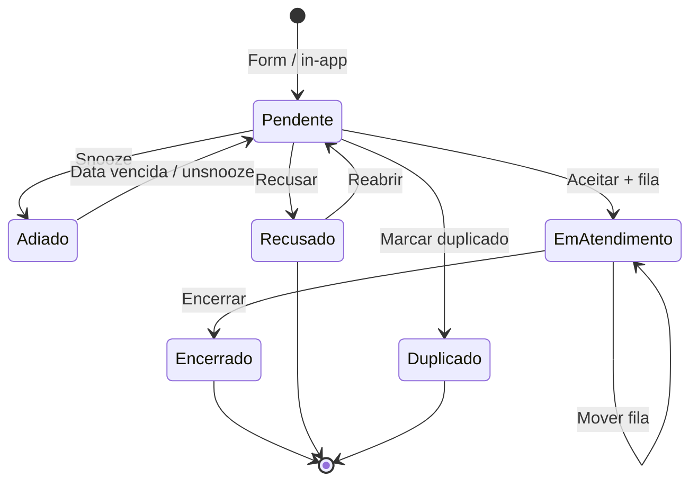

# Operoz — Sustentação: Filas de Atendimento (Spec)

| Campo           | Valor                                                            |
| --------------- | ---------------------------------------------------------------- |
| **Versão**      | 1.0                                                              |
| **Data**        | 2026-06-18                                                       |
| **Estado**      | Em implementação (Sprint 1)                                      |
| **Relacionado** | [operis-sustentacao-roadmap.md](./operis-sustentacao-roadmap.md) |

---

## 1. Problema

Hoje **Aceitar** um chamado define `status = ACCEPTED (1)` e move para a aba **Fechado**, como se a triagem tivesse terminado. Na operação real de sustentação:

1. **Aceitar** = assumir o chamado e encaminhar para uma **fila de trabalho** (N2, Dev, Infra…).
2. **Encerrar** = trabalho concluído → histórico.

O chamado aceito deve permanecer visível e acionável até ser explicitamente encerrado.

---

## 2. North Star

> _«Aceito cai na fila certa; o time trabalha; encerro quando resolvi — sem sumir da sustentação no meio.»_

---

## 3. Ciclo de vida



### Status `IntakeIssue.status`

| Valor | Constante   | Label UI       | Aba            |
| ----- | ----------- | -------------- | -------------- |
| `-2`  | `PENDING`   | Pendente       | Entrada        |
| `0`   | `SNOOZED`   | Adiado         | Entrada        |
| `1`   | `ACCEPTED`  | Em atendimento | Em atendimento |
| `3`   | `CLOSED`    | Encerrado      | Fechados       |
| `-1`  | `DECLINED`  | Recusado       | Fechados       |
| `2`   | `DUPLICATE` | Duplicado      | Fechados       |

> **Breaking semântico controlado:** `ACCEPTED` deixa de significar «fechado/aceite final» e passa a **Em atendimento**. Chamados já aceitos antes da migração permanecem em `ACCEPTED` na aba Em atendimento (não somem).

---

## 4. Filas configuráveis (board)

### Modelo `BoardSupportQueue`

| Campo          | Tipo   | Descrição                         |
| -------------- | ------ | --------------------------------- |
| `id`           | UUID   | PK                                |
| `workspace_id` | FK     | Workspace                         |
| `board_id`     | FK     | Board dono das filas              |
| `name`         | string | Nome ex.: «N2», «Desenvolvimento» |
| `slug`         | slug   | Único por board                   |
| `color`        | string | Hex para badge (#6366F1)          |
| `sort_order`   | int    | Ordem na sidebar                  |
| `is_default`   | bool   | Fila pré-selecionada no aceite    |
| `description`  | text   | Opcional                          |

**Regras:**

- CRUD em **Settings → Board → Sustentação → Filas** (admin board).
- Mínimo 1 fila publicada para aceitar chamados (seed «Geral» na migração).
- Apagar fila: soft delete; chamados existentes mantêm referência nula ou bloqueio se houver itens abertos (v1: SET_NULL).

### Chamado em atendimento

| Campo              | Onde             | Descrição                 |
| ------------------ | ---------------- | ------------------------- |
| `support_queue_id` | FK `IntakeIssue` | Fila atual                |
| `accepted_at`      | `extra`          | ISO timestamp             |
| `accepted_by`      | `extra`          | user id                   |
| `closed_at`        | `extra`          | ISO timestamp             |
| `closed_by`        | `extra`          | user id                   |
| `resolution_note`  | `extra`          | Nota opcional ao encerrar |

---

## 5. API

### Filas (board admin)

```
GET    /api/workspaces/{slug}/boards/{board_slug}/support-queues/
POST   /api/workspaces/{slug}/boards/{board_slug}/support-queues/
GET    /api/workspaces/{slug}/boards/{board_slug}/support-queues/{id}/
PATCH  /api/workspaces/{slug}/boards/{board_slug}/support-queues/{id}/
DELETE /api/workspaces/{slug}/boards/{board_slug}/support-queues/{id}/
```

### Filas (contexto projeto — triagem)

```
GET /api/workspaces/{slug}/projects/{project_id}/support-queues/
```

Resolve `board_id` do projeto; retorna filas ordenadas.

### Intake issue — transições

```
PATCH /api/workspaces/{slug}/projects/{project_id}/inbox-issues/{issue_id}/
```

| Payload                                     | Efeito                   |
| ------------------------------------------- | ------------------------ |
| `{ "status": 1, "queue_id": "uuid" }`       | Aceitar → em atendimento |
| `{ "status": 3, "resolution_note": "..." }` | Encerrar                 |
| `{ "queue_id": "uuid" }` (status já 1)      | Mover fila               |
| `{ "status": -1, ... }`                     | Recusar (existente)      |
| `{ "status": -2, "reopen": true }`          | Reabrir (existente)      |

**Validações:**

- Aceitar exige `queue_id` válido do board do projeto.
- Encerrar só a partir de `status = 1`.
- Mover fila só em `status = 1`.

### Listagem — filtros

| Query           | Descrição                        |
| --------------- | -------------------------------- |
| `status=-2`     | Entrada (pendente)               |
| `status=0`      | Adiados                          |
| `status=1`      | Em atendimento                   |
| `status=3,-1,2` | Fechados                         |
| `queue_id=uuid` | Sub-filtro na aba Em atendimento |

---

## 6. UI

### 6.1 Abas sidebar sustentação

| Aba            | i18n                           | Status   |
| -------------- | ------------------------------ | -------- |
| Entrada        | `inbox_issue.tabs.open`        | -2, 0    |
| Em atendimento | `inbox_issue.tabs.in_progress` | 1        |
| Fechados       | `inbox_issue.tabs.closed`      | 3, -1, 2 |

Sub-bar **Filas** na aba Em atendimento: pills por `BoardSupportQueue` + «Todas».

### 6.2 Ações header (por estado)

| Estado                           | Ações primárias                      |
| -------------------------------- | ------------------------------------ |
| Pendente / Adiado                | Aceitar · Recusar · Adiar            |
| Em atendimento                   | Encerrar · Mover fila                |
| Encerrado / Recusado / Duplicado | Reabrir (se aplicável) · Copiar link |

### 6.3 Modais

**Aceitar** — select fila (obrigatório) + confirmar.

**Encerrar** — nota de resolução (opcional) + confirmar.

**Mover fila** — select fila (dropdown no header ou modal).

### 6.4 Settings board

Secção **Filas** em Sustentação: tabela CRUD (nome, cor, ordem, default).

### 6.5 Metadados chamado

Badge fila (cor + nome), «Aceito em», «Encerrado em», nota de resolução.

---

## 7. Permissões

| Ação                            | Member | Admin projeto | Admin board |
| ------------------------------- | ------ | ------------- | ----------- |
| Aceitar / Encerrar / Mover fila | ✓      | ✓             | ✓           |
| CRUD filas                      | ✗      | ✗             | ✓           |
| Apagar chamado                  | ✗      | ✗             | ✓           |

---

## 8. Testes obrigatórios

| Área                | Casos                                        |
| ------------------- | -------------------------------------------- |
| `BoardSupportQueue` | CRUD, slug único, default único              |
| Aceitar             | exige queue_id; rejeita queue de outro board |
| Encerrar            | só status 1; grava resolution_note           |
| Mover fila          | PATCH queue_id em status 1                   |
| Listagem            | filtros status + queue_id                    |
| Metadata            | serializa fila no `support_ticket`           |

Path: `apps/api/operis/tests/unit/intake/`

---

## 9. Plano de implementação

### Sprint 1 (esta entrega)

- [x] Spec (este documento)
- [ ] Model + migration + seed «Geral»
- [ ] API filas + project support-queues
- [ ] Status CLOSED + accept/close validation
- [ ] UI: aba Em atendimento, modais aceitar/encerrar
- [ ] Settings: CRUD filas básico
- [ ] i18n pt-BR/en
- [ ] Testes unitários

### Sprint 2 (backlog)

- [ ] Mover fila (dropdown header)
- [ ] Contadores por fila na sidebar
- [ ] Automação: form → fila default por tema
- [ ] Métricas tempo por fila
- [ ] Design polish (resumo hero, links pill)

---

## 10. Referências técnicas

| Área         | Path                                                                        |
| ------------ | --------------------------------------------------------------------------- |
| Model intake | `apps/api/operis/db/models/intake.py`                                       |
| Model fila   | `apps/api/operis/db/models/board_support_queue.py`                          |
| Utils        | `apps/api/operis/utils/support_ticket.py`                                   |
| Serializer   | `apps/api/operis/app/serializers/intake.py`                                 |
| UI header    | `apps/web/core/components/inbox/content/inbox-issue-header.tsx`             |
| Store        | `apps/web/core/store/inbox/project-inbox.store.ts`                          |
| Settings     | `apps/web/core/components/settings/board/board-support-queues-settings.tsx` |
