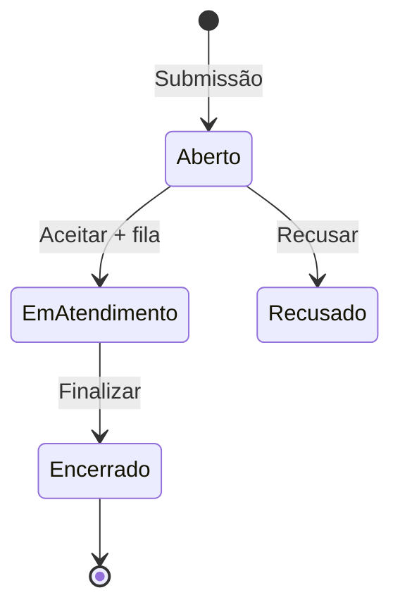

# Operoz — Sustentação: Formulário, Métricas e SLA por Criticidade

| Campo            | Valor                                                                                                                                                                                                                          |
| ---------------- | ------------------------------------------------------------------------------------------------------------------------------------------------------------------------------------------------------------------------------ |
| **Versão**       | 1.0                                                                                                                                                                                                                            |
| **Data**         | 2026-06-19                                                                                                                                                                                                                     |
| **Estado**       | **Fechada** — todas as decisões validadas                                                                                                                                                                                      |
| **Relacionados** | [operis-sustentacao-roadmap.md](./operis-sustentacao-roadmap.md), [operis-sustentacao-filas-spec.md](./operis-sustentacao-filas-spec.md), [operis-intake-sustentacao-split-spec.md](./operis-intake-sustentacao-split-spec.md) |

---

## 1. Resumo executivo

Este documento descreve a evolução do **módulo de Sustentação** em três frentes:

1. **Formulário de chamado** — campos padrão pré-instalados; **Cliente obrigatório e imutável**; demais removíveis.
2. **Métricas operacionais** — tempo até aceite (TTA) e tempo até conclusão (TTR).
3. **SLA por criticidade** — calculado na abertura, **editável manualmente**; referência = data de abertura; todas as criticidades (incl. P4 e «Não é incidente») participam de breach na Visão 360.

**Responsável do chamado:** não é campo do formulário — herda `Project.default_assignee` do cliente selecionado.

---

## 2. Decisões de produto (validadas)

| #   | Questão                                               | Decisão                                                                                                                                      |
| --- | ----------------------------------------------------- | -------------------------------------------------------------------------------------------------------------------------------------------- |
| 1   | Cliente pode ser removido do form?                    | **Não** — permanece obrigatório e bloqueado no builder (comportamento actual)                                                                |
| 2   | Campo SLA é calculado ou digitável?                   | **Calculado pela criticidade, mas pode ser alterado manualmente** (operador/admin na triagem ou no form pós-cálculo)                         |
| 3   | SLA usa abertura ou início do problema?               | **Abertura** (`IntakeIssue.created_at`)                                                                                                      |
| 4   | P4 e «Não é incidente» entram em breach na Visão 360? | **Sim** — todas as criticidades contam; cada uma com SLA configurável no board                                                               |
| 5   | Alterar criticidade recalcula SLA?                    | **Sim**, com registo no activity log                                                                                                         |
| 6   | Chamados legados sem criticidade?                     | **Sim** — fallback SLA 7 dias (`support_sla_days`)                                                                                           |
| 7   | Responsável no form?                                  | **Não** — retirar do form; usar `Project.default_assignee` do cliente                                                                        |
| 8   | «Aberto» — só label ou tudo?                          | **B** — toda a copy visível dentro do módulo Sustentação (aba, lista, badges, contadores, detalhe, filtros); código interno mantém `PENDING` |
| 9   | SLA manual + mudança de criticidade                   | **Manter** o SLA editado à mão — recálculo automático **não** sobrescreve override manual                                                    |

---

## 3. North Star

> _«O operador abre um chamado com os dados certos, vê o SLA calculado pela criticidade (ajustável se necessário), o responsável vem do cliente, e a Visão 360 mede breach real por criticidade.»_

---

## 4. Glossário

| Termo            | Significado                                                             |
| ---------------- | ----------------------------------------------------------------------- |
| **Chamado**      | `IntakeIssue` com `ticket_kind=support`                                 |
| **Aberto**       | Estado inicial (`status=PENDING`) — label UI na sustentação             |
| **Aceite**       | Operador assume → `status=ACCEPTED` + fila                              |
| **Encerramento** | Trabalho concluído → `status=CLOSED`                                    |
| **Criticidade**  | P0–P4 + «Não é incidente»                                               |
| **Responsável**  | `Project.default_assignee` do cliente (projeto) — **não** campo de form |
| **TTA**          | `accepted_at − opened_at`                                               |
| **TTR**          | `closed_at − opened_at`                                                 |

---

## 5. Épico A — Formulário

### 5.1 Campos padrão (7 campos — sem Responsável)

| #   | Campo                  | Tipo            | Obrigatório default | Removível? |
| --- | ---------------------- | --------------- | ------------------- | ---------- |
| 1   | **Cliente**            | `client`        | Sim                 | **Não**    |
| 2   | **Resumo**             | `name`          | Sim                 | Sim        |
| 3   | **Descrição**          | `description`   | Não                 | Sim        |
| 4   | **Criticidade**        | `criticality`   | Sim                 | Sim        |
| 5   | **Início do problema** | `datetime`      | Sim                 | Sim        |
| 6   | **SLA do chamado**     | `sla_due`       | —                   | Sim        |
| 7   | **Número do chamado**  | `ticket_number` | Não                 | Sim        |

#### Opções de Criticidade

| Valor          | Label           |
| -------------- | --------------- |
| `p0`           | P0 — CRÍTICO    |
| `p1`           | P1 — ALTO       |
| `p2`           | P2 — MÉDIO      |
| `p3`           | P3 — BAIXO      |
| `p4`           | P4 — PLANEJADO  |
| `not_incident` | NÃO É INCIDENTE |

### 5.2 Responsável automático (sem campo no form)

Na submissão, após resolver o **Cliente** → `project_id`:

```
assignee = Project.default_assignee do projeto cliente
```

| Situação                       | Comportamento                                                     |
| ------------------------------ | ----------------------------------------------------------------- |
| Cliente tem `default_assignee` | Issue criado com esse assignee; exibido no detalhe do chamado     |
| Cliente sem `default_assignee` | Chamado sem assignee até aceite manual                            |
| Aceite                         | `accepted_by` registra quem aceitou (pode ser ≠ default_assignee) |

Configuração do responsável por cliente: **Settings do projeto (cliente) → Default Assignee** (já existe).

### 5.3 Campo SLA — calculado + editável

| Momento                       | Comportamento                                                                                          |
| ----------------------------- | ------------------------------------------------------------------------------------------------------ |
| Seleção da criticidade (form) | Preenche `sla_due_at` = `now + duration(criticality)` _(preview antes de submeter)_                    |
| Após submissão                | Persiste `extra.support.sla_due_at`                                                                    |
| Edição manual                 | Operador altera data/hora → `sla_due_at_overridden: true` + guarda `sla_due_at_original`               |
| Mudança de criticidade        | Recalcula SLA **só se** `sla_due_at_overridden === false`; se editado à mão, **mantém** o valor manual |

**Fórmula base:**

```
sla_due_at = opened_at + board.sla_policy[criticality].duration_minutes
```

Referência de abertura: **`IntakeIssue.created_at`** (não `problem_started_at`).

### 5.4 Início do problema

- Campo informativo do solicitante.
- Persistido em `extra.support.problem_started_at`.
- **Não entra** no cálculo de breach de SLA.
- Uso: relatórios «tempo entre incidente e reporte».

### 5.5 Regras do builder

- **Cliente**: bloqueado — não remove, não despublica sem ele.
- Demais campos: reordenar, editar, remover.
- Form publicado exige campo `client` + `name` (Resumo).

---

## 6. Épico B — Ciclo de vida e métricas

### 6.1 Fluxo



### 6.2 Status ↔ UI

| Status      | Valor | Label          | Aba            |
| ----------- | ----- | -------------- | -------------- |
| `PENDING`   | -2    | **Aberto**     | Entrada        |
| `SNOOZED`   | 0     | Adiado         | Entrada        |
| `ACCEPTED`  | 1     | Em atendimento | Em atendimento |
| `CLOSED`    | 3     | Encerrado      | Fechados       |
| `REJECTED`  | -1    | Recusado       | Fechados       |
| `DUPLICATE` | 2     | Duplicado      | Fechados       |

### 6.3 Métricas

| Métrica                  | Fórmula                    |
| ------------------------ | -------------------------- |
| **TTA**                  | `accepted_at − created_at` |
| **TTR**                  | `closed_at − created_at`   |
| **Tempo em atendimento** | `closed_at − accepted_at`  |

Exibir no painel do chamado, lista (opcional) e Visão 360 (agregados).

### 6.4 Onde exibir métricas

- Detalhe do chamado — bloco «Métricas»
- Visão 360 → aba Sustentação — mediana TTA/TTR por cliente e criticidade
- Export CSV

### 6.5 Copy «Aberto» — escopo aprovado (opção B)

Tudo o que o utilizador vê **dentro do módulo Sustentação** passa a dizer **«Aberto»** no lugar de «Pendente» / «Entrada»:

| Superfície          | Exemplos                    |
| ------------------- | --------------------------- |
| Abas                | «Entrada» → **«Aberto»**    |
| Lista sidebar       | Status, empty states        |
| Badges e contadores | «3 abertos», pill de estado |
| Detalhe do chamado  | Header, metadados           |
| Filtros             | Labels de filtro rápido     |

**Fora de escopo:** Intake clássico, notificações email (v1), assistente IA, labels de API — mantêm «Pendente» ou equivalente técnico.

Status técnico inalterado: `IntakeIssue.status = PENDING (-2)`.

---

## 7. Épico C — SLA por criticidade

### 7.1 Configuração (Board → Sustentação → SLA)

Todas as criticidades têm duração configurável **e** participam de breach (decisão #4):

| Criticidade     | Default sugerido                      |
| --------------- | ------------------------------------- |
| P0 — CRÍTICO    | 4 horas                               |
| P1 — ALTO       | 8 horas                               |
| P2 — MÉDIO      | 24 horas                              |
| P3 — BAIXO      | 72 horas                              |
| P4 — PLANEJADO  | 168 horas (7 dias)                    |
| NÃO É INCIDENTE | 168 horas (7 dias) — **admin define** |

```json
{
  "p0": { "duration_minutes": 240 },
  "p1": { "duration_minutes": 480 },
  "p2": { "duration_minutes": 1440 },
  "p3": { "duration_minutes": 4320 },
  "p4": { "duration_minutes": 10080 },
  "not_incident": { "duration_minutes": 10080 }
}
```

Admin altera duração por criticidade. Sem toggle «excluir de breach» — todas contam na Visão 360.

### 7.2 Cálculo de conformidade

```
opened_at    = IntakeIssue.created_at
sla_due_at   = extra.support.sla_due_at  (calculado ou manual)
sla_breached = (aberto/em atendimento && now > sla_due_at)
            OR (encerrado && closed_at > sla_due_at)
```

**Legado:** sem criticidade → `support_sla_days` (7 dias default).

**Override manual:** breach usa o `sla_due_at` editado, não o recalculado.

### 7.3 Recálculo ao mudar criticidade

- Triagem altera criticidade → recalcula `sla_due_at` a partir de `opened_at` + nova duração **apenas se o SLA não foi editado manualmente**.
- Se `sla_due_at_overridden === true`: **preserva** o valor manual; regista no activity log a mudança de criticidade sem alterar o SLA.
- Se não houve override: recalcula e regista valor anterior + novo valor no activity log.
- Operador pode **limpar override** explicitamente («Usar SLA da criticidade») para voltar ao cálculo automático.

### 7.4 Visão 360

- KPI «SLA estourado» usa policy por criticidade.
- P4 e «Não é incidente» **incluídos** nos agregados.
- Filtro `sla_breach` mantém semântica.

---

## 8. Modelo de dados

### 8.1 Novos field types

```typescript
"criticality"; // select fechado
"ticket_number"; // text
"sla_due"; // datetime — calculado, editável
```

### 8.2 `IntakeIssue.extra.support`

```json
{
  "support": {
    "criticality": "p1",
    "problem_started_at": "2026-06-19T08:30:00-03:00",
    "ticket_number": "INC-2026-0042",
    "sla_due_at": "2026-06-19T16:30:00-03:00",
    "sla_due_at_original": "2026-06-19T16:30:00-03:00",
    "sla_due_at_overridden": false,
    "assignee_from_project": "user-uuid",
    "metrics": {
      "time_to_accept_seconds": 720,
      "time_to_resolve_seconds": 14400
    }
  }
}
```

### 8.3 `BoardSupportSlaPolicy`

| Campo      | Tipo                                       |
| ---------- | ------------------------------------------ |
| `board_id` | FK                                         |
| `policies` | JSON (6 criticidades → `duration_minutes`) |

---

## 9. Plano de implementação

### Sprint 1 — Formulário

- [ ] Tipos `criticality`, `ticket_number`, `sla_due`
- [ ] Seed 7 campos padrão (sem Responsável)
- [ ] Auto-assignee via `Project.default_assignee`
- [ ] SLA preview reativo + override na submissão
- [ ] UI builder + Space

### Sprint 2 — Métricas + copy

- [ ] TTA / TTR / tempo em atendimento
- [ ] Renomear copy sustentação → «Aberto» (**escopo B** — abas, lista, badges, contadores, detalhe, filtros)
- [ ] Painel métricas no detalhe

### Sprint 3 — SLA por criticidade

- [ ] `BoardSupportSlaPolicy` + UI settings
- [ ] Breach por criticidade; legado 7 dias
- [ ] Recálculo ao mudar criticidade + activity log
- [ ] Visão 360 actualizada

### Sprint 4 — Analytics

- [ ] Agregados por criticidade; export CSV

---

## 9.1 Épico D — Tracking / histórico do chamado (v1 entregue)

Timeline vertical no detalhe do chamado (hub Sustentação), inspirada no exemplo de fluxo:

| Elemento                | Comportamento                                      |
| ----------------------- | -------------------------------------------------- |
| Linha vertical + ícones | Eventos cronológicos                               |
| Badge «Fluxo»           | Passos do ciclo de vida                            |
| Card de abertura        | Campos do formulário + solicitante                 |
| Aceite / Encerramento   | Timestamp + duração (TTA / TTR)                    |
| Comentários             | Integrados na timeline                             |
| Colapsar                | «Mostrar mais (N anteriores)» — últimos 5 visíveis |
| Comentário novo         | Caixa no rodapé                                    |

**Ficheiros:** `support-ticket-tracking-panel.tsx`, `support-ticket-tracking.utils.ts`

**v2 (Sprints 2–3):** criticidade, SLA manual, movimento de fila, forms de interação.

---

## 10. Critérios de aceite

### Formulário

- Form novo tem 7 campos; Cliente não remove.
- Ao escolher cliente MAGALU, assignee = default assignee do projeto MAGALU.
- Ao escolher P1, SLA preenche automaticamente; operador pode alterar data/hora.

### Métricas

- Aberto 10:00, aceite 10:12 → TTA = 12 min.
- Encerrado 14:00 → TTR = 4 h.

### SLA

- P0 4h, aberto há 5h → badge «SLA estourado».
- «Não é incidente» com SLA 7d configurado → conta breach se estourar.
- Chamado legado sem criticidade → fallback 7 dias.
- Mudança P2→P0 recalcula SLA desde abertura **se SLA não foi editado manualmente**.
- SLA editado manualmente + mudança de criticidade → SLA **permanece** inalterado.

---

## 11. Fora de escopo v1

- SLA de primeira resposta (só resolução).
- Escalação automática P0.
- Sync ITSM externo.
- SLA por fila.

---

## 16. Spec fechada

Todas as decisões de produto validadas. Pronta para Sprint 1.
