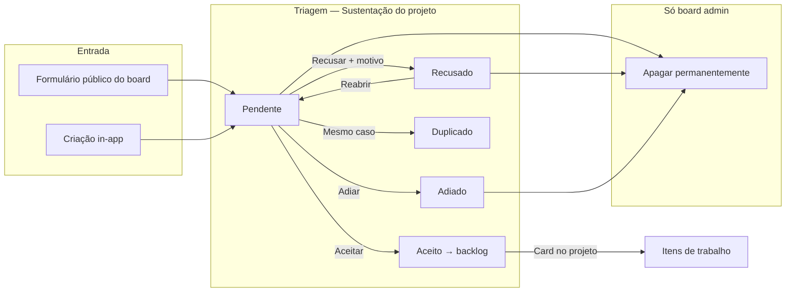

# Operoz — Módulo de Sustentação (Chamados): Roadmap completo

**Documento mestre de visão, diagnóstico, fases e referências técnicas.**

| Campo            | Valor                                                                                                                                                                                                        |
| ---------------- | ------------------------------------------------------------------------------------------------------------------------------------------------------------------------------------------------------------ |
| **Versão**       | 0.1                                                                                                                                                                                                          |
| **Data**         | 2026-06-17                                                                                                                                                                                                   |
| **Estado**       | Fases 0–3 implementadas — backend + UI triagem funcional                                                                                                                                                     |
| **Escopo**       | Transformar a tela de intake/inbox do projeto em **módulo de Chamados de Sustentação** com identidade, governança e integração board                                                                         |
| **Relacionados** | [operis-cliente-360-mvp.md](./operis-cliente-360-mvp.md), [operis-visao-360-roadmap.md](./operis-visao-360-roadmap.md), [operis-intake-sustentacao-split-spec.md](./operis-intake-sustentacao-split-spec.md) |

---

## 1. Visão

A **Sustentação** é a fila de triagem onde entram bugs, feedbacks, melhorias e incidentes enviados por clientes (formulários públicos do board) ou criados in-app. Cada entrada é um **chamado de sustentação** — não um card de backlog — até ser **aceito** e convertido em item de trabalho.

**North Star:** _"O operador abre um chamado e em segundos sabe cliente, origem, tipo, SLA e próxima ação — com governança clara: recusar sim, apagar só admin do board."_

### Princípios

1. **Chamado ≠ card** — linguagem, layout e permissões distintos até a aceitação.
2. **Recusar é reversível** — histórico preservado; recusado permanece consultável.
3. **Apagar é exceção** — apenas admin do board (`board.administer`), com auditoria.
4. **Board centraliza formulários** — um ou mais forms por board com campo **Cliente**; cada projeto (cliente) recebe a fila de triagem local.
5. **Integração Cliente 360** — sustentação alimenta a dimensão `support` do health score.

### Premissa de engenharia

**Toda entrega de sustentação inclui testes unitários** — backend (`pytest` em `apps/api/operis/tests/unit/intake/`) e frontend quando houver lógica isolável (hooks, utils). Não mergear permissões ou regras de negócio sem cobertura mínima.

---

## 2. Contexto de produto (Operoz Squad-as-a-Service)

| Decisão já tomada                  | Detalhe                                                                                                                              |
| ---------------------------------- | ------------------------------------------------------------------------------------------------------------------------------------ |
| Formulários no **board**           | `BoardIntakeForm` — não um form por projeto                                                                                          |
| Campo **Cliente**                  | Lista fechada; roteia ticket para a sustentação do projeto correto                                                                   |
| Vários formulários                 | Temas: bugs, melhorias, incidentes                                                                                                   |
| Migração                           | Forms legados por projeto → board (`0175_board_intake_form.py`)                                                                      |
| Copy UI                            | Aba e módulo renomeados para **Sustentação** (pt-BR)                                                                                 |
| **Separação Intake × Sustentação** | Decisão **A** — coexistem no mesmo projeto; ver [operis-intake-sustentacao-split-spec.md](./operis-intake-sustentacao-split-spec.md) |

---

## 3. Diagnóstico — estado atual (baseline)

Referência: tela `/projects/{id}/intake` (hub de sustentação do projeto).

| Área                  | Estado atual                                                             | Gap vs. visão                                       |
| --------------------- | ------------------------------------------------------------------------ | --------------------------------------------------- |
| **Copy**              | Aba «Sustentação» ✓                                                      | Ações/modais ainda falam «item de trabalho»         |
| **Layout**            | Clone do detalhe de issue genérico                                       | Falta identidade de chamado/ticket                  |
| **Recusar**           | Existe (`IntakeIssue.status = -1`)                                       | Sem motivo obrigatório; sem feedback ao solicitante |
| **Apagar**            | Admin do **projeto** ou **criador** do issue                             | Deve ser só **admin do board**                      |
| **Aceitar/Recusar**   | UI exige **admin do projeto** (`handleActionWithPermission`)             | Operadores (member) ficam bloqueados na triagem     |
| **Origem**            | `InboxSourcePill` vazio no CE                                            | Não mostra formulário, cliente, tema                |
| **Metadados do form** | Gravados em `IntakeIssue.extra`, FKs `intake_form` / `board_intake_form` | Não exibidos de forma destacada na UI               |
| **Cliente 360**       | Dimensão `support`, `support_sla_days`, métricas                         | Não ligada visualmente ao chamado na triagem        |
| **Assistente**        | Tool `list_intake_pending`                                               | Pode evoluir para linguagem «chamados»              |

### Modelo de dados existente

**`IntakeIssue`** (`apps/api/operis/db/models/intake.py`):

| Status    | Valor | Label     |
| --------- | ----- | --------- |
| Pending   | `-2`  | Pendente  |
| Rejected  | `-1`  | Recusado  |
| Snoozed   | `0`   | Adiado    |
| Accepted  | `1`   | Aceito    |
| Duplicate | `2`   | Duplicado |

Campos relevantes: `source`, `source_email`, `intake_form`, `board_intake_form`, `extra` (JSON).

### Permissões atuais (código)

| Ação                      | Frontend                                                          | Backend                                       |
| ------------------------- | ----------------------------------------------------------------- | --------------------------------------------- |
| Aceitar / Recusar / Adiar | Member permitido na lógica, mas botões gated por `isProjectAdmin` | `@allow_permission` ADMIN/MEMBER              |
| Apagar                    | `canDelete` = admin projeto **ou** criador                        | `destroy`: admin projeto (role 20) ou creator |

**Ficheiros-chave:**

| Camada                | Path                                                                                     |
| --------------------- | ---------------------------------------------------------------------------------------- |
| Model board form      | `apps/api/operis/db/models/board_intake_form.py`                                         |
| Submit público        | `apps/api/operis/utils/board_intake_submission.py`                                       |
| API intake            | `apps/api/operis/app/views/intake/base.py`, `apps/api/operis/api/views/intake.py`        |
| UI triagem            | `apps/web/core/components/inbox/**`                                                      |
| Header ações          | `apps/web/core/components/inbox/content/inbox-issue-header.tsx`                          |
| Settings board        | `apps/web/core/components/settings/board/board-intake-forms-settings.tsx`                |
| Rota settings         | `apps/web/app/(all)/[workspaceSlug]/(settings)/settings/boards/[boardSlug]/sustentacao/` |
| i18n pt-BR            | `packages/i18n/src/locales/pt-BR/translations.ts`                                        |
| Permissão board admin | `apps/api/operis/app/permissions/board_access.py` (`board.administer`)                   |
| Cliente 360 types     | `packages/types/src/board/client-360.ts`                                                 |

---

## 4. Ciclo de vida alvo



### Matriz de permissões alvo

| Ação               | Member (projeto) | Admin projeto | Admin board (`board.administer`) |
| ------------------ | ---------------- | ------------- | -------------------------------- |
| Aceitar            | ✓                | ✓             | ✓                                |
| Recusar            | ✓                | ✓             | ✓                                |
| Adiar / Duplicar   | ✓                | ✓             | ✓                                |
| Reabrir            | ✓                | ✓             | ✓                                |
| Comentar (triagem) | ✓                | ✓             | ✓                                |
| **Apagar**         | ✗                | ✗             | **✓**                            |

---

## 5. Roadmap por fases

### Fase 0 — Fundação (1–2 sprints)

_Alinhar governança e terminologia antes de polir UI._

| ID  | Funcionalidade                                                                                                  | Backend                                   | Frontend                                                 | Prioridade |
| --- | --------------------------------------------------------------------------------------------------------------- | ----------------------------------------- | -------------------------------------------------------- | ---------- |
| 0.1 | Renomear copy global — «chamado de sustentação» em ações, modais, empty states, tabs                            | —                                         | i18n `inbox_issue.*`, `project.intake.*`                 | **P0**     |
| 0.2 | Permissão de **apagar** — remover delete para member/creator; permitir só `board.administer` ou workspace admin | `IntakeIssueViewSet.destroy`, API pública | Esconder «Excluir»; tooltip explicativo                  | **P0**     |
| 0.3 | Permissão de **triagem** — member pode aceitar/recusar/adiar; duplicar pode ficar admin                         | Revisar `allow_permission` se necessário  | Remover gate `isProjectAdmin` nos botões Aceitar/Recusar | **P0**     |
| 0.4 | Auditoria de delete — log quem apagou, quando, motivo obrigatório                                               | `IssueActivity` ou evento dedicado        | Modal «Motivo da exclusão»                               | P1         |
| 0.5 | Estados renomeados na UI — badges com cores de sustentação                                                      | —                                         | `inbox-status-icon`, i18n status                         | P1         |

**Critério de done:** operador recusa chamado; não vê «Excluir»; admin do board apaga com motivo registrado.

**Checklist Fase 0:**

- [x] 0.1 Copy pt-BR/en (`inbox_issue.*`, modais)
- [x] 0.2 Backend delete → board admin (`operis/utils/intake_permissions.py`)
- [x] 0.2 Frontend hide delete (`useSupportTicketCapabilities`)
- [x] 0.3 Member triagem liberada (aceitar/recusar/adiar/duplicar)
- [x] 0.4 Audit trail delete (`intake.activity.deleted` + modal motivo)
- [x] 0.5 Badges de status (SLA, origem, fila)
- [x] Testes unitários `test_intake_permissions.py`, `test_support_ticket.py` (32 testes)

---

### Fase 1 — Identidade visual de chamado (2 sprints)

_A tela deixa de parecer issue genérico._

| ID  | Funcionalidade                 | Detalhe                                                                                  |
| --- | ------------------------------ | ---------------------------------------------------------------------------------------- |
| 1.1 | Cabeçalho de chamado           | Nº (`OPERI-8`), badge status, SLA, origem                                                |
| 1.2 | Painel de metadados            | Cliente, formulário, tema (bug/melhoria/incidente), e-mail, data abertura, tempo em fila |
| 1.3 | Lista lateral estilo fila      | Solicitante, tipo, prioridade sugerida, ícone form, idade («há 2h»)                      |
| 1.4 | Implementar `InboxSourcePill`  | «Formulário público · Chamado Sustentação», «In-app», etc.                               |
| 1.5 | Campos do formulário read-only | Bloco «Dados do solicitante» com respostas custom + anexos                               |
| 1.6 | Anexos em destaque             | Secção acima da descrição                                                                |
| 1.7 | Tokens visuais                 | Temas `support` / `incident` dos forms aplicados ao hub                                  |

**Critério de done:** abrir um chamado e identificar em ≤3s: cliente, origem, tipo, estado.

**Checklist Fase 1:**

- [x] 1.1 Header chamado (SLA badge, status, atalhos A/R)
- [x] 1.2 Metadados (`SupportTicketMetadataPanel`)
- [x] 1.3 Lista fila (form name, queue age, prioridade)
- [x] 1.4 Source pill
- [x] 1.5 Campos form read-only (submission_fields no painel)
- [x] 1.6 Anexos acima da descrição
- [x] 1.7 Tokens visuais (form_theme no painel)

---

### Fase 2 — Triagem operacional (2–3 sprints)

_Fila de trabalho do time de sustentação._

| ID  | Funcionalidade        | Detalhe                                                                                                                           |
| --- | --------------------- | --------------------------------------------------------------------------------------------------------------------------------- |
| 2.1 | Filas e vistas        | Aberto (pendente + adiado), **Em atendimento** (aceito + fila), Fechado (encerrado/recusado/duplicado), «Meus», «Sem responsável» |
| 2.2 | Filtros               | Formulário, tipo, cliente, prioridade, SLA estourado, com anexo                                                                   |
| 2.3 | Ordenação             | Mais antigo, SLA, prioridade                                                                                                      |
| 2.4 | Atribuição na triagem | Responsável antes de aceitar + notificação                                                                                        |
| 2.5 | Contadores sidebar    | Badge «Sustentação» = pendentes (parcialmente existe via `intake_count`)                                                          |
| 2.6 | Atalhos teclado       | `A` aceitar, `R` recusar, `→` próximo                                                                                             |
| 2.7 | Bulk actions (admin)  | Aceitar/recusar em lote com motivo                                                                                                |

**Checklist Fase 2:**

- [x] 2.1 Vistas (Aberto / **Em atendimento** / Fechado + Meus/Sem responsável)
- [x] 2.1b Filas configuráveis no board + aceitar com fila + encerrar (Sprint 1 — ver `operis-sustentacao-filas-spec.md`)
- [x] 2.2 Filtros (origem, SLA, anexo)
- [ ] 2.3 Ordenação (existente; SLA/prioridade dedicados — backlog)
- [ ] 2.4 Atribuição na triagem
- [x] 2.5 Contadores sidebar (`intake_count`)
- [x] 2.6 Atalhos (`A`/`R`/setas)
- [ ] 2.7 Bulk actions

---

### Fase 3 — Ciclo de vida do chamado (2 sprints)

_Regras de negócio de helpdesk._

| ID  | Funcionalidade                               | Detalhe                                                                      |
| --- | -------------------------------------------- | ---------------------------------------------------------------------------- |
| 3.1 | Recusar com motivo obrigatório               | Categorias: fora de escopo, duplicado, info insuficiente, spam + texto livre |
| 3.2 | Recusado ≠ apagado                           | Permanece em Fechado; audit trail                                            |
| 3.3 | Reabrir chamado                              | Recusado → pendente                                                          |
| 3.4 | Aceitar com opções                           | Módulo/épico, prioridade, assignee, labels na conversão                      |
| 3.5 | Duplicado                                    | Ligar a chamado/card existente + nota                                        |
| 3.6 | Adiar (snooze)                               | Data + motivo; reaparece na fila                                             |
| 3.7 | Comentários internos vs. resposta ao cliente | Thread interna; resposta pública (Fase 6)                                    |
| 3.8 | SLA por board                                | `support_sla_days` do Cliente 360; badge ao estourar                         |

**Checklist Fase 3:**

- [x] 3.1 Motivo recusa (categoria + texto)
- [x] 3.2 Retenção recusados
- [x] 3.3 Reabrir
- [ ] 3.4 Aceitar com opções (modal existente; épico/módulo — backlog)
- [x] 3.5 Duplicado
- [x] 3.6 Snooze + motivo
- [ ] 3.7 Comentários interno/externo
- [x] 3.8 SLA badge

---

### Fase 4 — Integração board + Cliente 360 (2 sprints)

_Sustentação como produto do board._

| ID  | Funcionalidade                | Detalhe                                                        |
| --- | ----------------------------- | -------------------------------------------------------------- |
| 4.1 | Dashboard board               | Widget «Chamados abertos por cliente» (Visão 360)              |
| 4.2 | Drill-down Cliente 360        | Link «Ver fila de sustentação» no cliente                      |
| 4.3 | Métricas                      | Tempo médio triagem, taxa aceite/recusa, volume por formulário |
| 4.4 | Tipos de intake configuráveis | `intake_types` do board refletidos na UI                       |
| 4.5 | Playbooks                     | Aceitar incidente → playbook «Incidente P1»                    |
| 4.6 | Automações                    | Novo chamado → Slack/e-mail → round-robin                      |

**Checklist Fase 4:**

- [ ] 4.1 Widget board
- [ ] 4.2 Link Cliente 360
- [ ] 4.3 Métricas
- [ ] 4.4 Tipos intake UI
- [ ] 4.5 Playbooks
- [ ] 4.6 Automações entrada

---

### Fase 5 — Formulários e entrada (1–2 sprints)

_Complemento ao `BoardIntakeForm` (já implementado)._

| ID  | Funcionalidade              | Detalhe                                       |
| --- | --------------------------- | --------------------------------------------- |
| 5.1 | Temas por tipo              | Bug → `support`, Incidente → `incident`       |
| 5.2 | Prioridade sugerida no form | Mapeada ao chamado                            |
| 5.3 | Rate limit + captcha        | Reforçar UX (backend parcial)                 |
| 5.4 | Página de confirmação       | Nº chamado + e-mail acompanhamento            |
| 5.5 | Remover UI legada           | Forms por projeto descontinuados pós-migração |

**Checklist Fase 5:**

- [ ] 5.1 Temas
- [ ] 5.2 Prioridade
- [ ] 5.3 Captcha/rate limit UX
- [ ] 5.4 Confirmação pública
- [ ] 5.5 Cleanup UI projeto

---

### Fase 6 — Portal do solicitante (3 sprints, opcional)

_Experiência externa de ticket._

| ID  | Funcionalidade                                  |
| --- | ----------------------------------------------- |
| 6.1 | Link «Acompanhar chamado» (token + e-mail)      |
| 6.2 | Status: recebido → em triagem → aceito/recusado |
| 6.3 | Resposta da equipa visível ao cliente           |
| 6.4 | Reabertura pelo cliente (configurável)          |

**Checklist Fase 6:**

- [ ] 6.1 Token acompanhamento
- [ ] 6.2 Status público
- [ ] 6.3 Resposta cliente
- [ ] 6.4 Reabertura

---

### Fase 7 — Assistente e qualidade (1 sprint)

| ID  | Funcionalidade                                                        |
| --- | --------------------------------------------------------------------- |
| 7.1 | Assistente: «chamados pendentes do cliente X» (`list_intake_pending`) |
| 7.2 | Sugestão duplicados na triagem (`useDebouncedDuplicateIssues`)        |
| 7.3 | Resumo automático ao aceitar                                          |

**Checklist Fase 7:**

- [ ] 7.1 Linguagem assistente
- [ ] 7.2 Duplicados UX
- [ ] 7.3 Resumo aceite

---

## 6. Priorização sugerida

```text
Sprint 1–2   Fase 0 + 1.1–1.5     → permissões + cara de chamado
Sprint 3–4   Fase 3.1–3.4 + 2.1   → recusar com motivo + filas
Sprint 5–6   Fase 2 + 4.1–4.3     → operação diária + Cliente 360
Sprint 7+    Fase 5–7             → portal, automações, assistente
```

### MVP mínimo (validação com squad)

1. Copy «chamado de sustentação» em toda a tela
2. Delete só board admin
3. Member pode aceitar/recusar
4. Recusar com motivo
5. Metadados do formulário visíveis no detalhe
6. Lista com origem + tempo em fila

---

## 7. Implementação técnica — notas para dev

### 7.1 Delete restrito a board admin

**Problema:** permissão hoje é nível **projeto**; requisito é **board**.

**Abordagem:**

1. Resolver `project_id` → `board_id` (via associação projeto↔board existente).
2. Em `destroy`, checar `get_effective_board_permission_keys` + `permission_granted(..., "board.administer")`.
3. Fallback: workspace admin.
4. Frontend: expor flag `can_delete_support_ticket` no serializer ou derivar no client com hook de board role.

**Ficheiros a alterar:**

- `apps/api/operis/app/views/intake/base.py` — `IntakeIssueViewSet.destroy`
- `apps/api/operis/api/views/intake.py` — `IntakeIssueDetailAPIEndpoint.delete`
- `apps/web/core/components/inbox/content/inbox-issue-header.tsx` — `canDelete`
- `apps/web/core/components/inbox/modals/delete-issue-modal.tsx` — copy + motivo

### 7.2 Triagem por member

Remover `handleActionWithPermission(isProjectAdmin, ...)` dos botões **Aceitar** e **Recusar**; manter admin-only apenas onde fizer sentido (ex.: bulk delete, políticas de retenção).

### 7.3 Metadados do formulário na UI

Serializer `IntakeIssueSerializer` deve incluir (ou expandir):

- `board_intake_form` (nome, tema)
- `intake_form` (legado)
- `extra.client` / campos custom do submit
- `source_email`

### 7.4 Source pill

Implementar CE stub em `apps/web/ce/components/inbox/source-pill.tsx` (atualmente retorna vazio).

### 7.5 SLA

Ler `support_sla_days` de `client-360-health-settings`; calcular breach com `created_at` do chamado; badge no header.

### 7.6 i18n

Chaves principais:

- `sidebar.intake` → «Sustentação»
- `project.intake.subtitle`
- `inbox_issue.*` → substituir «item de trabalho» por «chamado de sustentação»
- `boards.settings.intake_forms.*`

### 7.7 Migração produção

Migration `0175_board_intake_form` — correr migrator no deploy:

```bash
docker compose run --rm migrator
```

---

## 8. Riscos e decisões em aberto

| #   | Tema                          | Opções                              | Recomendação                                   |
| --- | ----------------------------- | ----------------------------------- | ---------------------------------------------- |
| 1   | Admin board vs. admin projeto | Hoje tudo é permissão de projeto    | Delete = board admin; triagem = member projeto |
| 2   | Card aceito                   | Link bidirecional chamado ↔ card    | Campo «Originado do chamado OPERI-N» no card   |
| 3   | Retenção recusados            | 90 dias / indefinido / configurável | Configurável no board (Fase 3)                 |
| 4   | E-mail ao recusar             | Automático vs. manual               | Fase 3 manual; Fase 6 automático               |
| 5   | Termo interno código          | Manter `intake`, `IntakeIssue`      | Sim — só copy UI muda                          |

---

## 9. Copy de referência (pt-BR)

| Contexto            | Texto                                                                                                                          |
| ------------------- | ------------------------------------------------------------------------------------------------------------------------------ |
| Aba navegação       | Sustentação                                                                                                                    |
| Subtítulo hub       | Sustentação de clientes — bugs, feedbacks e solicitações recebidos dos formulários. Triagem antes de virarem itens no backlog. |
| Aceitar             | Aceitar chamado                                                                                                                |
| Recusar             | Recusar chamado                                                                                                                |
| Apagar (admin)      | Excluir chamado permanentemente                                                                                                |
| Empty state sidebar | Nenhum chamado aberto                                                                                                          |

---

## 10. Histórico do documento

| Versão | Data       | Autor                            | Notas                                                                     |
| ------ | ---------- | -------------------------------- | ------------------------------------------------------------------------- |
| 0.2    | 2026-06-17 | Operoz                           | Fase 0 P0: permissões delete/triagem, copy chamados, testes unitários     |
| 0.1    | 2026-06-17 | Operoz (planejamento assistente) | Roadmap inicial pós-implementação BoardIntakeForm + rename UI Sustentação |

---

## 11. Referências cruzadas no monorepo

- Board intake forms settings: `apps/web/core/constants/board-settings.ts` → nav `Sustentação`
- Formulário público Space: `apps/space/components/intake/intake-public-form.tsx`
- Manual Operoz: `packages/i18n/src/locales/pt-BR/operoz-manual.ts` → secção `knowledge_intake`
- Assistente intake: `apps/api/operis/assistant/tools/handlers.py` → `list_intake_pending`
