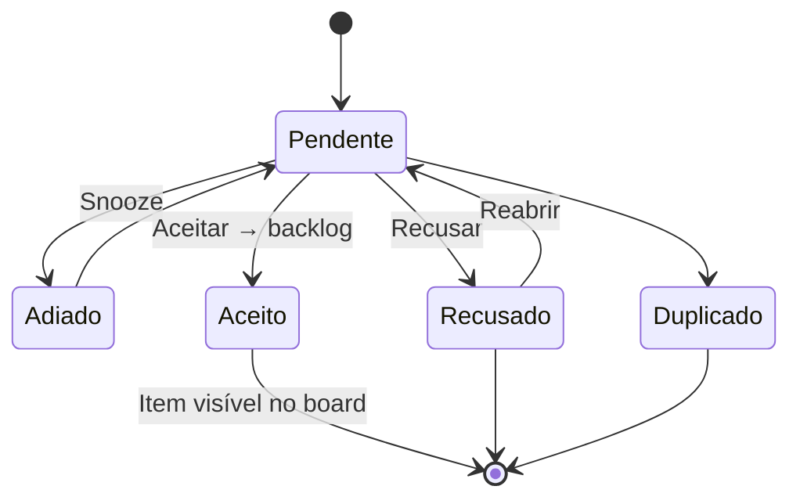

# Operoz — Intake × Sustentação: Separação de Módulos (Spec)

| Campo            | Valor                                                                                                                                    |
| ---------------- | ---------------------------------------------------------------------------------------------------------------------------------------- |
| **Versão**       | 1.0                                                                                                                                      |
| **Data**         | 2026-06-18                                                                                                                               |
| **Estado**       | Aprovado (decisão produto)                                                                                                               |
| **Decisão**      | **A** — Intake e Sustentação podem coexistir no **mesmo projeto**                                                                        |
| **Relacionados** | [operoz-sustentacao-roadmap.md](./operoz-sustentacao-roadmap.md), [operoz-sustentacao-filas-spec.md](./operoz-sustentacao-filas-spec.md) |

---

## 1. Problema

Hoje a Operoz **fundiu** dois conceitos numa única rota e flag:

| Conceito original (Plane)                               | Conceito Operoz (Squad-as-a-Service)                 |
| ------------------------------------------------------- | ---------------------------------------------------- |
| **Intake** — entrada de trabalho do **próprio projeto** | **Sustentação** — chamados de **clientes** via board |
| Formulários no **projeto**                              | Formulários no **board** + campo Cliente             |
| Aceitar → **promove item para o backlog**               | Aceitar → **fila de atendimento**, sem card          |
| Linguagem «work item» / triagem interna                 | Linguagem «chamado», filas, encerrar                 |

A UI em `/projects/{id}/intake` virou **Sustentação**, mas o backend ainda tem `IntakeForm` (projeto), `BoardIntakeForm` (board) e um único `IntakeIssue` para ambos.

**Objetivo:** manter a **Sustentação** como está (filas, encerrar, metadados de chamado) e **restaurar o Intake clássico** como módulo separado, com formulários por projeto e aceite no board.

---

## 2. North Star

> _«No mesmo projeto MAGALU, o time recebe chamados de sustentação do cliente **e** pode ter intake interno de melhorias — cada um no seu lugar, sem confundir fila com backlog.»_

---

## 3. Dois produtos lado a lado

| Dimensão             | **Intake**                                                      | **Sustentação**                                              |
| -------------------- | --------------------------------------------------------------- | ------------------------------------------------------------ |
| **Público**          | Time do projeto (interno)                                       | Operadores + clientes (formulários públicos)                 |
| **Formulários**      | `IntakeForm` — CRUD no **projeto**                              | `BoardIntakeForm` — CRUD no **board**                        |
| **Rota hub**         | `/projects/{id}/intake`                                         | `/projects/{id}/sustentacao`                                 |
| **Settings**         | Projeto → Features → **Intake**                                 | Board → **Sustentação** (forms + filas)                      |
| **Feature flag**     | `intake_view`                                                   | `support_view` (nova)                                        |
| **Aceitar**          | `status=1` + **move issue para backlog** (state fora de triage) | `status=1` + **fila obrigatória**, issue permanece em triage |
| **Encerrar**         | N/A (aceite = fim do intake)                                    | `status=3` (CLOSED) + nota opcional                          |
| **Abas**             | Aberto / Fechado (clássico)                                     | Aberto / Em atendimento / Fechados                           |
| **Copy pt-BR**       | Intake                                                          | Sustentação                                                  |
| **Contador sidebar** | `intake_count` (pendentes intake)                               | `support_count` (pendentes sustentação)                      |

### Coexistência (decisão A)

- Um projeto **pode** ter `intake_view=true` **e** `support_view=true` ao mesmo tempo.
- Nav do projeto mostra **dois itens** quando as flags respectivas estão activas.
- Submissões de `IntakeForm` → sempre `ticket_kind=intake`.
- Submissões de `BoardIntakeForm` (ou roteamento por Cliente) → sempre `ticket_kind=support`.
- APIs de listagem **filtram por `ticket_kind`** — nunca misturar filas na UI.

---

## 4. Modelo de dados

### 4.1 Campo discriminador `ticket_kind`

Adicionar em `IntakeIssue`:

```python
class IntakeTicketKind(models.TextChoices):
    INTAKE = "intake", "Intake"
    SUPPORT = "support", "Support"
```

| Valor     | Quando é definido                                                                  |
| --------- | ---------------------------------------------------------------------------------- |
| `support` | `board_intake_form_id` preenchido; ou origem board public form / email sustentação |
| `intake`  | `intake_form_id` preenchido; criação in-app intake; legacy sem board form          |

**Migração de dados:**

```sql
-- Pseudológica
UPDATE intake_issues SET ticket_kind = 'support'
WHERE board_intake_form_id IS NOT NULL;

UPDATE intake_issues SET ticket_kind = 'intake'
WHERE ticket_kind IS NULL;
```

Índice composto: `(project_id, ticket_kind, status)`.

### 4.2 Feature flags no `Project`

| Campo          | Default | Descrição           |
| -------------- | ------- | ------------------- |
| `intake_view`  | `false` | Hub Intake clássico |
| `support_view` | `false` | Hub Sustentação     |

**Migração de flags (projetos existentes):**

- Projetos com `intake_view=true` hoje (usando sustentação) → `support_view=true` **e** manter `intake_view=false` salvo excepção documentada.
- Script de migração + nota no changelog.

Serializer expõe ambos:

```typescript
type TProject = {
  intake_view: boolean;
  support_view: boolean;
  intake_count?: number; // pendentes kind=intake
  support_count?: number; // pendentes kind=support, status pending/snoozed
};
```

### 4.3 O que **não** duplicar

- Tabela `IntakeIssue` — **única**, discriminada por `ticket_kind`.
- Tabela `Issue` — continua a ser o «container» do work item subjacente.
- `IntakeForm` e `BoardIntakeForm` — **mantidos**; cada um alimenta o kind correcto.

---

## 5. Ciclo de vida por módulo

### Intake (clássico)



- **Aceitar (`status=1`):** issue sai do state triage → state backlog/default; `IntakeIssue` vai para aba Fechado.
- **Sem** `support_queue`, **sem** `CLOSED (3)`, **sem** modal de fila.

### Sustentação (actual — ver filas spec)

- Inalterado em regras de negócio já implementadas.
- Endpoints filtram `ticket_kind=support`.

---

## 6. API

### 6.1 Separação de rotas (recomendado)

Manter compatibilidade temporária; novas rotas explícitas:

| Módulo      | Listagem                                                  | Detalhe / PATCH                         |
| ----------- | --------------------------------------------------------- | --------------------------------------- |
| Intake      | `GET .../projects/{id}/intake-issues/?ticket_kind=intake` | `PATCH .../intake-issues/{issue_id}/`   |
| Sustentação | `GET .../projects/{id}/support-tickets/`                  | `PATCH .../support-tickets/{issue_id}/` |

**v1 pragmática:** reutilizar `inbox-issues` com query obrigatória `ticket_kind=intake|support`; depreciar listagens sem filtro.

### 6.2 Criação

| Origem               | Endpoint                             | `ticket_kind` |
| -------------------- | ------------------------------------ | ------------- |
| Form projeto         | `POST .../intake-forms/{id}/submit/` | `intake`      |
| Form board (público) | Space submit existente               | `support`     |
| In-app intake        | `POST .../intake-issues/`            | `intake`      |
| In-app sustentação   | `POST .../support-tickets/`          | `support`     |

Validação:

- `create_intake_submission(..., intake_form=)` exige `project.intake_view`.
- `submit_board_intake_form(...)` exige `project.support_view`.

### 6.3 Serializer — aceite bifurcado

```python
def apply_accept(instance, *, queue_id, ticket_kind):
    if ticket_kind == "support":
        validate_accept(..., queue_id=queue_id)
        # issue permanece em triage
    elif ticket_kind == "intake":
        promote_issue_to_backlog(instance.issue)
        # sem queue_id
```

---

## 7. Frontend

### 7.1 Rotas

| Rota                         | Componente                            | Store                 |
| ---------------------------- | ------------------------------------- | --------------------- |
| `/projects/{id}/intake`      | `IntakeIssueRoot` (novo / restaurado) | `projectIntakeStore`  |
| `/projects/{id}/sustentacao` | `SupportTicketRoot` (actual inbox)    | `projectSupportStore` |

Renomear/refactor:

- `apps/web/core/components/inbox/**` → mover lógica sustentação para `support/**` (incremental).
- Recriar `apps/web/core/components/intake/hub/**` para UI clássica.

### 7.2 Navegação do projeto

```typescript
// ce/components/projects/navigation/helper.tsx
{ key: "intake", href: "/intake", shouldRender: project.intake_view }
{ key: "support", href: "/sustentacao", shouldRender: project.support_view }
```

Badges:

- Intake: `intake_count`
- Sustentação: `support_count`

### 7.3 Settings

| Onde                        | Conteúdo                                                                         |
| --------------------------- | -------------------------------------------------------------------------------- |
| Projeto → Features → Intake | Toggle `intake_view`; CRUD `IntakeForm`; **remover** banner «migrado para board» |
| Board → Sustentação         | Forms board + filas (como hoje)                                                  |

### 7.4 UI Intake (clássico) — escopo mínimo v1

- Sidebar: Aberto / Fechado.
- Detalhe: título, descrição, anexos, actividade.
- Acções: Aceitar (modal opções backlog), Recusar, Duplicado, Snooze, Reabrir.
- **Sem** painel chamado, **sem** filas, **sem** encerrar.
- Botão «Criar» intake in-app (restaurar no header do intake).

### 7.5 UI Sustentação — mantém actual

- Tudo o que foi entregue (filas, sustentação form panel, 3 abas, encerrar).
- Apenas muda rota para `/sustentacao` e filtro `ticket_kind=support`.

---

## 8. i18n e copy

| Chave                                  | pt-BR                                                      |
| -------------------------------------- | ---------------------------------------------------------- |
| `project.navigation.intake`            | Intake                                                     |
| `project.navigation.support`           | Sustentação                                                |
| `project.features.intake.description`  | Entrada de trabalho do projeto — aceite vira item no board |
| `project.features.support.description` | Chamados de clientes — filas de atendimento e histórico    |

Evitar «inbox» / «work item» na sustentação; evitar «chamado» no intake.

---

## 9. Permissões

| Acção                      | Intake                              | Sustentação          |
| -------------------------- | ----------------------------------- | -------------------- |
| Ver                        | MEMBER+                             | MEMBER+              |
| Aceitar / Recusar / Snooze | MEMBER+                             | MEMBER+              |
| Apagar                     | Admin projeto ou board (definir v1) | Admin board + motivo |
| CRUD forms                 | Admin projeto                       | Admin board          |

---

## 10. Cliente 360 e métricas

- Dimensão **support** do health score: **apenas** `ticket_kind=support`.
- Intake interno **não** contamina SLA de sustentação.

---

## 11. Plano de implementação

### Sprint S0 — Fundação (1 semana)

- [ ] Migration: `ticket_kind` + `support_view` + backfill
- [ ] Migration flags: projectos activos → `support_view=true`
- [ ] API: filtro `ticket_kind` obrigatório nas listagens
- [ ] Serializer: aceite bifurcado + testes
- [ ] Types + `support_count` / `intake_count` no project serializer
- [ ] Spec self-review ✓

### Sprint S1 — Rotas e nav (1 semana)

- [ ] Rota `/sustentacao` + redirect temporário `/intake` → `/sustentacao` se só support activo
- [ ] Dois itens na nav; badges separados
- [ ] Settings projeto: reactivar IntakeForm sem banner migração
- [ ] Toggle `support_view` em features do projeto (ou derivado do board)

### Sprint S2 — Hub Intake UI (1–2 semanas)

- [ ] `IntakeHub` sidebar + detalhe (fork simplificado do inbox legado)
- [ ] Aceitar → promote backlog (restaurar lógica Plane)
- [ ] Modal criar chamado intake no header
- [ ] Forms públicos projeto (`/forms/{anchor}`) → `ticket_kind=intake`

### Sprint S3 — Polish (1 semana)

- [ ] Power-K / atalhos separados
- [ ] Assistente: tools `list_support_pending` vs `list_intake_pending`
- [ ] Remover redirects legacy; depreciar `inbox-issues` sem kind
- [ ] Actualizar roadmap + manual

---

## 12. Riscos e mitigação

| Risco                              | Mitigação                                    |
| ---------------------------------- | -------------------------------------------- |
| Links/bookmarks `/intake` partidos | Redirect inteligente 302 por 2 releases      |
| Contagem sidebar errada            | Recalcular queries com `ticket_kind`         |
| Aceitar intake move board errado   | Testes contract + state mapping por project  |
| Duplicar stores MobX               | Extrair base `TicketHubStore` com kind param |

---

## 13. Critérios de done (v1)

1. Projeto com **ambas** flags vê Intake e Sustentação na nav.
2. Form board → só aparece em Sustentação; form projeto → só em Intake.
3. Aceitar intake cria item visível no board; aceitar sustentação vai para fila.
4. Nenhuma regressão nos 40+ testes intake existentes (extendidos com kind).
5. MAGALU (ou equivalente) continua sustentação intacta após migração de flag.

---

## 14. Fora de escopo v1

- Email inbound separado por módulo
- Bulk actions intake
- Unificar `IntakeIssue` em modelos distintos (C da análise anterior)
- Intake com filas (filas são exclusivas de sustentação)

---

## 15. Referências técnicas

| Peça                   | Path                                                             |
| ---------------------- | ---------------------------------------------------------------- |
| Model IntakeIssue      | `apps/api/operoz/db/models/intake.py`                            |
| IntakeForm (projeto)   | `apps/api/operoz/db/models/intake_form.py`                       |
| BoardIntakeForm        | `apps/api/operoz/db/models/board_intake_form.py`                 |
| Submit projeto         | `apps/api/operoz/utils/intake_submission.py`                     |
| Submit board           | `apps/api/operoz/utils/board_intake_submission.py`               |
| Serializer sustentação | `apps/api/operoz/app/serializers/intake.py`                      |
| UI sustentação actual  | `apps/web/core/components/inbox/**`                              |
| Settings forms projeto | `apps/web/core/components/intake/forms/intake-settings-view.tsx` |
| Project flags          | `apps/api/operoz/db/models/project.py` (`intake_view`)           |

---

## Changelog

| Versão | Data       | Notas                                                   |
| ------ | ---------- | ------------------------------------------------------- |
| 1.0    | 2026-06-18 | Spec inicial; decisão A (coexistência no mesmo projeto) |
