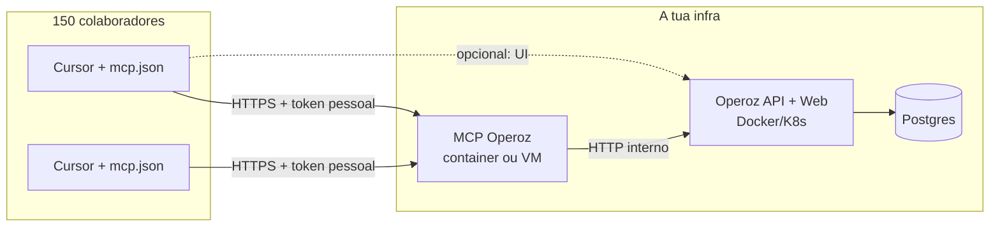

# Operoz MCP — implantação para empresa (~150 utilizadores Cursor)

Objetivo: **ninguém clona o monorepo Operoz**. A equipa usa o **Operoz hospedado** no browser; no Cursor só configura o **MCP** para criar tarefas, boards, cards, páginas (PRD), etc.

## Arquitetura recomendada



| Camada     | O que hospedas                                                              | Quem usa           |
| ---------- | --------------------------------------------------------------------------- | ------------------ |
| **Operoz** | `https://operoz.sua-empresa.com`                                            | Todos (web)        |
| **MCP**    | `https://mcp.sua-empresa.com/mcp` (recomendado) ou pacote interno via `npx` | Só quem usa Cursor |

O código do MCP continua **no mesmo repositório** que o Operoz; em produção corres **uma imagem Docker** `operoz-mcp` (só `mcp-server/`), não o monorepo inteiro nos PCs.

## O que cada pessoa faz (uma vez)

1. Entra no Operoz → **Definições → API tokens** → cria token **pessoal** (não partilhar).
2. No Cursor, ficheiro global `~/.cursor/mcp.json` (ou política IT que o distribui):

### Opção A — MCP centralizado (ideal para 150 pessoas)

Quando o serviço HTTP estiver ativo no vosso deploy (`npm run start:http` / imagem `operoz-mcp`):

```json
{
  "mcpServers": {
    "operoz": {
      "url": "https://mcp.sua-empresa.com/mcp",
      "headers": {
        "Authorization": "Bearer SEU_TOKEN_PESSOAL"
      }
    }
  }
}
```

Cada colaborador substitui `SEU_TOKEN_PESSOAL`. **Sem clone**, **sem Node** no portátil (só Cursor).

> **Nota Cursor:** se a ligação remota falhar no Agent, workaround temporário: `npx -y mcp-remote https://mcp.sua-empresa.com/mcp` com `command`/`args` em vez de `url` (ver fórum Cursor sobre SSE/Streamable HTTP).

### Opção B — Sem servidor MCP dedicado (ainda hoje)

IT instala **uma vez** o binário MCP (imagem Docker ou artefacto em rede interna). O colaborador **não** clona o Operoz:

```json
{
  "mcpServers": {
    "operoz": {
      "command": "node",
      "args": ["/usr/lib/operoz/mcp-server/dist/index.js"],
      "env": {
        "OPEROZ_API_BASE_URL": "https://operoz.sua-empresa.com",
        "OPEROZ_API_KEY": "token-pessoal"
      }
    }
  }
}
```

Ou, com imagem Docker publicada internamente:

```json
{
  "mcpServers": {
    "operoz": {
      "command": "docker",
      "args": [
        "run",
        "-i",
        "--rm",
        "-e",
        "OPEROZ_API_BASE_URL=https://operoz.sua-empresa.com",
        "-e",
        "OPEROZ_API_KEY",
        "registry.sua-empresa.com/operoz-mcp:1.0.0"
      ],
      "env": {
        "OPEROZ_API_KEY": "token-pessoal"
      }
    }
  }
}
```

## Mapeamento: o que pedem no Cursor → ferramentas MCP

| Pedido habitual             | Ferramenta MCP                                                                | API           | Auth            |
| --------------------------- | ----------------------------------------------------------------------------- | ------------- | --------------- |
| **Tarefa / card / issue**   | `operoz_create_work_item`, `operoz_update_work_item`, …                       | v1 `/api/v1/` | Token API       |
| **Projeto (cliente)**       | `operoz_create_project`, …                                                    | v1            | Token API       |
| **Estados, labels, ciclos** | `operoz_list_states`, …                                                       | v1            | Token API       |
| **Board Operoz**            | `operoz_list_boards`, `operoz_create_board`, …                                | app `/api/`   | **Sessão** hoje |
| **Cliente 360**             | `operoz_board_client_360_*`                                                   | app           | Sessão          |
| **PRD / doc**               | `operoz_create_page`, `operoz_update_page_description`, …                     | app           | Sessão          |
| **Status report**           | `operoz_create_board_status_report`, `operoz_create_project_status_report`, … | app           | Sessão          |
| Qualquer endpoint novo      | `operoz_api_v1_request` / `operoz_api_app_request`                            | v1 / app      | Token / sessão  |

### Limitação importante (boards + documentos)

- **Work items (tarefas)** funcionam bem só com **API token** — é o caminho principal para 150 pessoas.
- **Boards, páginas (PRD), Cliente 360** usam a API **app**, que hoje pede **cookie de sessão** (`operoz_sign_in` ou `OPEROZ_SESSION_COOKIE`). Num MCP **partilhado** (um servidor para todos), login por password na ferramenta **não** é aceitável.

**Roadmap recomendado para a tua empresa:**

1. **Fase 1 (já):** token por utilizador → tarefas, projetos, comentários, pesquisa.
2. **Fase 2:** MCP HTTP centralizado com token no header (deploy `operoz-mcp`).
3. **Fase 3:** estender API ou MCP para boards/páginas com o **mesmo token** (sem cookie), ou OAuth corporativo (SSO).
4. **Fase 4:** templates/prompts internos para PRD e status report (as tools já existem).

Exemplo PRD hoje (com sessão configurada):

```json
{
  "method": "POST",
  "path": "/workspaces/MEU-WS/projects/UUID-DO-PROJETO/pages/",
  "body": { "name": "PRD — Feature X", "description_html": "<p>...</p>" }
}
```

via `operoz_api_app_request`.

## Segurança (150 pessoas)

| Regra                                           | Motivo                                          |
| ----------------------------------------------- | ----------------------------------------------- |
| **1 token = 1 pessoa**                          | Auditoria e revogação                           |
| MCP atrás de **HTTPS** + VPN ou IP allowlist    | Tokens não trafegam em claro                    |
| Não commitar tokens no Git                      | Usar `~/.cursor/mcp.json` ou gestor de segredos |
| Rotacionar tokens ao sair colaborador           | Mesmo fluxo que API keys                        |
| Aprovar servidor MCP no Cursor (Settings → MCP) | Política de segurança do Cursor                 |

## Deploy do MCP na infra (resumo)

**Guia completo:** [deploy-mcp-vps.md](./deploy-mcp-vps.md) (Dockerfile, compose, NPM, GitHub Actions).

1. Imagem: `mcp-server/Dockerfile` ou GHCR `operoz-mcp:preview`
2. `deployments/mcp/docker-compose.yml` + `operoz-mcp.env` (sem tokens de utilizador)
3. Variáveis do **servidor**: `OPEROZ_API_BASE_URL`, `MCP_ALLOWED_HOSTS`
4. NPM → `https://mcp.sua-empresa.com` → porta `3100`
5. Cada pessoa: token no `~/.cursor/mcp.json` (modelo `.cursor/mcp.json.enterprise.example`)

## Rollout sugerido

1. Piloto 5–10 pessoas (só work items + projetos com token).
2. Validar prompts típicos: “cria tarefa no projeto X”, “move para Em progresso”, “comenta na OPEROZ-123”.
3. Adicionar boards/PRD quando auth app estiver resolvido (Fase 3).
4. Distribuir `mcp.json` via IT (GPO/script) apontando para URL central.

## Estado atual do repositório

| Item                                    | Estado                                               |
| --------------------------------------- | ---------------------------------------------------- |
| MCP stdio (dev / Opção B)               | ✅ `npm run start`                                   |
| 379 ferramentas (API v1 + app completa) | ✅                                                   |
| MCP HTTP para equipa sem clone          | ✅ Docker + [deploy-mcp-vps.md](./deploy-mcp-vps.md) |
| Ferramentas PRD / páginas dedicadas     | ✅                                                   |
| Boards só com token (sem sessão)        | 🔜 requer API ou proxy de sessão                     |

Ver também: [mcp-server/README.md](../mcp-server/README.md), [operoz-mcp.md](./operoz-mcp.md).
