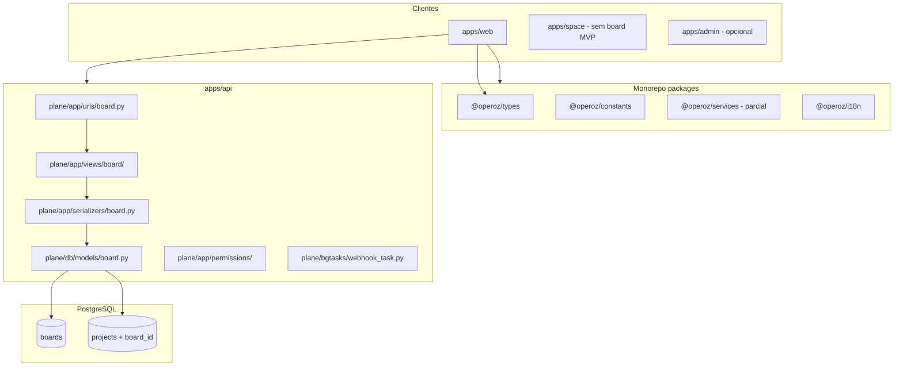

# Tech4Humans — Boards: guia de implementação (arquitetura, segurança, desenvolvimento)

Documento técnico para **construir e validar** a feature Boards no fork Plane. Complementa o plano de produto e decisões em [tech4humans-boards-plano-desenvolvimento.md](./tech4humans-boards-plano-desenvolvimento.md) e o contexto organizacional em [tech4humans-plane-organizacao.md](./tech4humans-plane-organizacao.md).

**Validação:** caminhos de ficheiro, classes e padrões abaixo foram conferidos no repositório em maio/2026 (migração mais recente: `0122_workspace_issue_email_notification_flags.py`).

**Status:** pronto para desenvolvimento MVP-1 → MVP-2  
**Público:** engenharia fullstack

---

## Sumário

1. [Mapa de documentos](#1-mapa-de-documentos)
2. [Decisões de produto (resumo executivo)](#2-decisões-de-produto-resumo-executivo)
3. [Arquitetura alvo](#3-arquitetura-alvo)
4. [Modelo de dados](#4-modelo-de-dados)
5. [API — desenho e ficheiros](#5-api--desenho-e-ficheiros)
6. [Segurança](#6-segurança)
7. [Frontend — desenho e ficheiros](#7-frontend--desenho-e-ficheiros)
8. [Funcionalidades por onda](#8-funcionalidades-por-onda)
9. [Como desenvolver (ordem de PRs)](#9-como-desenvolver-ordem-de-prs)
10. [Como validar (checklist técnico)](#10-como-validar-checklist-técnico)
11. [Testes automatizados](#11-testes-automatizados)
12. [Deploy e migração](#12-deploy-e-migração)
13. [Armadilhas validadas no código](#13-armadilhas-validadas-no-código)
14. [Referências de código (índice)](#14-referências-de-código-índice)

---

## 1. Mapa de documentos

| Documento                                                                                    | Papel                                               |
| -------------------------------------------------------------------------------------------- | --------------------------------------------------- |
| [tech4humans-plane-organizacao.md](./tech4humans-plane-organizacao.md)                       | Porquê Boards; limitações do Plane stock            |
| [tech4humans-boards-plano-desenvolvimento.md](./tech4humans-boards-plano-desenvolvimento.md) | Produto, Jira ref, roadmap MVP-1/2, decisões D1–D10 |
| **Este ficheiro**                                                                            | Como construir, arquitetura, segurança, validação   |

---

## 2. Decisões de produto (resumo executivo)

Registo completo em [§3 do plano](./tech4humans-boards-plano-desenvolvimento.md). Impacto direto na implementação:

| ID    | Decisão                         | Implementação                                     |
| ----- | ------------------------------- | ------------------------------------------------- |
| D1    | UI «Boards»                     | `boards.*` em i18n; entidade `Board`              |
| D2    | Projeto novo exige board        | `POST /projects/` valida `board_id`               |
| D2b   | Sem voltar a null               | `PATCH` rejeita `board_id: null` se já definido   |
| D3    | Todos os membros WS veem boards | Sem `BoardMember`; list = `WorkspaceMember` ativo |
| D4    | Só admin cria board             | `POST /boards/` ADMIN workspace                   |
| D5–D6 | Mover projeto; arquivar board   | `PATCH` projeto; `Board.archived_at`              |
| D7    | URL `/boards/{slug}`            | Campo `Board.slug` único por workspace            |
| D8    | Analytics por board no MVP-1    | `board_id` → resolve `project_ids`                |
| D9    | Tabela `boards` nova            | Não usar `teams`                                  |
| D10   | Legado sem board automático     | `board_id` null só legado; sidebar «Sem board»    |

---

## 3. Arquitetura alvo

### 3.1 Hierarquia

**Canónica Tech4Humans (vocabulário → entidade):**

`Workspace` → `Board` (time) → `Project` (épico) → `Issue` (card) → `Issue` filho (subtarefa, recursivo).

```text
Instance (Plane self-host)
└── Workspace (slug: tech4humans)
    ├── Board (slug: squad-as-a-service)     ← NOVO — time
    │   └── Project (board_id FK)            ← épico de negócio
    │       ├── Issue (card)
    │       │   └── Issue (subtarefa → …)
    │       └── Module, Cycle, …             ← opcional dentro do projeto
    └── [projetos legados board_id = null]   ← «Sem board»
```

**Importante:** Board **não** é pai direto de Issue. Issues mantêm `project_id`; o board filtra via `project.board_id`.

### 3.2 Diagrama de camadas



### 3.3 Princípios arquiteturais (validados no fork)

1. **Board é entidade de workspace** — mesmo nível que `WorkspaceView`, `Sticky`, não é filho de `Project`. Modelo com `FK(Workspace)` apenas (não usar `ProjectBaseModel`).

2. **Projeto mantém FK dupla** — `workspace` (já existe) + `board` (novo). Em `Project.save()`, garantir `board.workspace_id == project.workspace_id`.

3. **URLs de trabalho profundo inalteradas** — Issues continuam em `/api/workspaces/{slug}/projects/{project_id}/issues/`. Board não entra no path de issue (decisão D7).

4. **Agregação cross-project** — Para MVP-2, copiar padrão de `WorkspaceViewIssuesViewSet` (`GET /workspaces/{slug}/issues/`) com filtro extra `project__board_id`.

5. **Serviços web** — CRUD de board em `apps/web/core/services/board/` (padrão `project.service.ts`), não em `@operoz/services` (projetos também estão só no web).

6. **Não estender stubs CE `team*`** — `ce/store/issue/team*` declara «will never be used»; criar `EIssuesStoreType.BOARD` + stores em `core/store/issue/board/`.

---

## 4. Modelo de dados

### 4.1 Tabela `boards`

**Ficheiro novo:** `apps/api/operoz/db/models/board.py`

| Coluna                                    | Tipo              | Notas                                          |
| ----------------------------------------- | ----------------- | ---------------------------------------------- |
| `id`                                      | UUID PK           | Herda `BaseModel`                              |
| `workspace_id`                            | FK → `workspaces` | CASCADE                                        |
| `name`                                    | VARCHAR(255)      | Unique com workspace (soft delete)             |
| `slug`                                    | SlugField(48)     | Unique com workspace; validador como workspace |
| `description`                             | TEXT              | blank                                          |
| `logo_props`                              | JSONField         | default `{}`                                   |
| `sort_order`                              | FLOAT             | default 65535                                  |
| `archived_at`                             | DateTime          | null                                           |
| `created_by_id`, timestamps, `deleted_at` |                   | padrão `BaseModel`                             |

**Constraint (validado — padrão `Team` / `Workspace`):**

```python
models.UniqueConstraint(
    fields=["workspace", "slug"],
    condition=models.Q(deleted_at__isnull=True),
    name="board_unique_slug_workspace_when_deleted_at_null",
)
```

**Slug:** reutilizar `slug_validator` de `apps/api/operoz/db/models/workspace.py` (linha 114).

### 4.2 Alteração `projects`

**Ficheiro:** `apps/api/operoz/db/models/project.py`

```python
board = models.ForeignKey(
    "db.Board",
    on_delete=models.SET_NULL,
    null=True,
    blank=True,
    related_name="board_projects",
)
```

**`save()` override ou validação no serializer:**

- Se `self.board_id` e `self.board.workspace_id != self.workspace_id` → `ValidationError`.

### 4.3 Migração

| Passo | Ficheiro                             | Conteúdo                                         |
| ----- | ------------------------------------ | ------------------------------------------------ |
| 1     | `0123_board_and_project_board_id.py` | `CreateModel(Board)` + `AddField(project.board)` |
| 2     | —                                    | **Sem** `RunPython` em massa (D10)               |

**Export:** `apps/api/operoz/db/models/__init__.py` — adicionar `Board`.

### 4.4 O que NÃO criar no MVP

| Entidade             | Motivo                                                                            |
| -------------------- | --------------------------------------------------------------------------------- |
| `BoardMember`        | D3                                                                                |
| `BoardUserProperty`  | Ordenação de boards: `sort_order` no board; projetos mantêm `ProjectUserProperty` |
| Reuso tabela `teams` | D9; modelo órfão sem API (`grep` sem views/serializers)                           |

---

## 5. API — desenho e ficheiros

### 5.1 Rotas novas

**Ficheiro novo:** `apps/api/operoz/app/urls/board.py`

Registrar em `apps/api/operoz/app/urls/__init__.py`.

| Método | Path                                             | View                  | Permissão                |
| ------ | ------------------------------------------------ | --------------------- | ------------------------ |
| GET    | `workspaces/<slug>/boards/`                      | `BoardViewSet.list`   | WS: ADMIN, MEMBER, GUEST |
| POST   | `workspaces/<slug>/boards/`                      | `BoardViewSet.create` | WS: **ADMIN**            |
| GET    | `workspaces/<slug>/boards/<board_slug>/`         | `retrieve` por slug   | WS member                |
| PATCH  | `workspaces/<slug>/boards/<board_slug>/`         | `partial_update`      | WS: ADMIN                |
| DELETE | `workspaces/<slug>/boards/<board_slug>/`         | soft delete           | WS: ADMIN                |
| POST   | `workspaces/<slug>/boards/<board_slug>/archive/` | `archived_at=now`     | WS: ADMIN                |

**Lookup:** `get_object()` por `slug` + `workspace__slug` (não expor só UUID na URL pública — D7).

### 5.2 Alterações em projetos (validado — `ProjectViewSet`)

**Ficheiro:** `apps/api/operoz/app/views/project/base.py`

| Método                  | Alteração                                                   |
| ----------------------- | ----------------------------------------------------------- |
| `get_queryset` / `list` | `select_related("board")`; filtro opcional `?board_id=`     |
| `create`                | Exigir `board_id`; validar board no workspace               |
| `partial_update`        | Aceitar `board_id`; bloquear `null` se já tinha board (D2b) |

**Serializers:** `apps/api/operoz/app/serializers/project.py`

- `BoardLiteSerializer` (id, name, slug, logo_props)
- Incluir `board_id` + `board` nested em `ProjectListSerializer` / `ProjectSerializer`

### 5.3 Board issues agregados (MVP-2)

**Padrão validado:** `WorkspaceViewIssuesViewSet` em `apps/api/operoz/app/views/view/base.py` (linha 138+)

| Aspecto          | Workspace global                                   | Board (novo)                                            |
| ---------------- | -------------------------------------------------- | ------------------------------------------------------- |
| Path             | `GET .../workspaces/{slug}/issues/`                | `GET .../workspaces/{slug}/boards/{board_slug}/issues/` |
| Queryset base    | `Issue.issue_objects.filter(workspace__slug=slug)` | + `project__board_id=board.id`                          |
| Permissões guest | `_get_project_permission_filters()`                | **Reutilizar igual**                                    |
| Filtros          | `IssueFilterSet`, `issue_filters`                  | **Reutilizar igual**                                    |
| Serializer       | `ViewIssueListSerializer`                          | **Reutilizar igual**                                    |

**Ficheiro novo:** `apps/api/operoz/app/views/board/issues.py` — classe `BoardIssuesEndpoint(BaseAPIView)` ou método no `BoardViewSet`.

### 5.4 Analytics (D8 — MVP-1)

**Validado:**

- Filtros: `apps/api/operoz/utils/date_utils.py` → `get_analytics_filters(..., project_ids=...)`
- Views: `apps/api/operoz/app/views/analytic/advance.py`
- Front: `apps/web/core/services/analytics.service.ts` + `TAnalyticsFilterParams` em `packages/types/src/analytics.ts` (hoje só `project_ids`, `cycle_id`, `module_id`)

**Alteração:**

1. Aceitar query `board_id` (ou `board_ids`) nos endpoints `advance-analytics*`.
2. Resolver: `project_ids = Project.objects.filter(board_id=X, workspace__slug=slug).values_list("id", flat=True)`.
3. Passar para `get_analytics_filters(slug, user, ..., project_ids=ids)`.
4. Front: dropdown boards → envia `board_id`; opcionalmente preenche `project_ids` no cliente.

### 5.5 Webhooks (opcional MVP-1, recomendado)

**Ficheiro:** `apps/api/operoz/bgtasks/webhook_task.py`

- Adicionar `"board": BoardSerializer` em `SERIALIZER_MAPPER` / `MODEL_MAPPER`
- Flag `board` em `db/models/webhook.py` + migração
- `model_activity.delay(model_name="board", ...)` em create/update board

Referência de create: `ProjectViewSet.create` linha ~290 e `ModuleViewSet.create`.

### 5.6 ViewSet template (copiar de)

| Caso                         | Template validado            | Caminho                         |
| ---------------------------- | ---------------------------- | ------------------------------- |
| CRUD workspace-scoped        | `WorkspaceStickyViewSet`     | `app/views/workspace/sticky.py` |
| Lista com permissões projeto | `ProjectViewSet.list`        | `app/views/project/base.py`     |
| Issues cross-project         | `WorkspaceViewIssuesViewSet` | `app/views/view/base.py`        |

**Export views:** `apps/api/operoz/app/views/__init__.py`

---

## 6. Segurança

### 6.1 Modelo de ameaças

| Ameaça                                                | Mitigação                                                       |
| ----------------------------------------------------- | --------------------------------------------------------------- |
| IDOR: aceder board de outro workspace                 | Toda query filtra `workspace__slug=kwargs["slug"]`              |
| IDOR: associar projeto a board de outro WS            | Serializer valida `board.workspace_id == project.workspace_id`  |
| IDOR: `board_id` em analytics de outro WS             | Resolver board só dentro do slug da request                     |
| Escalada: member cria board                           | D4: só `ROLE.ADMIN` em POST                                     |
| Guest vê issues de projeto privado via board agregado | Reutilizar `_get_project_permission_filters()` sem relaxar      |
| Membro vê projeto sem ser `ProjectMember`             | Inalterado: board não contorna `ProjectMember` / `network`      |
| Projeto legado null exposto indevidamente             | Listagem «Sem board» usa mesmo filtro que `ProjectViewSet.list` |

### 6.2 Matriz de permissões (MVP)

| Ação                                 | Guest WS       | Member WS      | Admin WS       |
| ------------------------------------ | -------------- | -------------- | -------------- |
| Listar boards                        | Sim            | Sim            | Sim            |
| Ver página board / projetos listados | Sim\*          | Sim\*          | Sim            |
| Criar board                          | Não            | Não            | Sim            |
| Editar/arquivar board                | Não            | Não            | Sim            |
| Criar projeto (exige board)          | Não\*\*        | Sim\*\*\*      | Sim            |
| Ver issues no board agregado (MVP-2) | Regras projeto | Regras projeto | Regras projeto |

\* Ver board; projetos dentro respeitam membership.  
\*\* Guest workspace normalmente não cria projeto.  
\*\*\* Member + projetos públicos conforme `ProjectViewSet.list` (linhas 115–127).

### 6.3 Implementação de permissões (sem novo nível `BOARD`)

**Validado:** `allow_permission` em `apps/api/operoz/app/permissions/base.py` só tem `WORKSPACE` e `PROJECT` (default).

Para Boards no MVP:

- Usar **`level="WORKSPACE"`** em todos os endpoints de board.
- **Não** adicionar `level="BOARD"` até existir `BoardMember` (pós-MVP).

Exemplo create board:

```python
@allow_permission(allowed_roles=[ROLE.ADMIN], level="WORKSPACE")
def create(self, request, slug):
    ...
```

### 6.4 Regras de validação (serializers)

| Regra                                       | Onde                                     |
| ------------------------------------------- | ---------------------------------------- |
| `board_id` required on POST project         | `ProjectSerializer.validate` ou `create` |
| `board_id` not null on PATCH if already set | `ProjectSerializer.validate`             |
| `board.workspace == project.workspace`      | `validate_board_id`                      |
| `slug` único no workspace                   | `BoardSerializer`                        |
| Não arquivar board com validação extra      | Opcional: warning se único board e D2    |

### 6.5 Auditoria

- `model_activity` / webhooks em board CRUD
- Log opcional quando `project.board_id` muda (campo em activity de projeto se existir)

---

## 7. Frontend — desenho e ficheiros

### 7.1 Estrutura de ficheiros novos

```text
apps/web/
  core/
    services/board/board.service.ts
    store/board/board.store.ts
    store/board/index.ts
    components/workspace/sidebar/boards-list.tsx
    components/workspace/sidebar/board-projects-list.tsx
    components/board/create-board-modal.tsx
    components/board/board-overview.tsx
  app/(all)/[workspaceSlug]/(projects)/boards/
    [boardSlug]/page.tsx
    [boardSlug]/layout.tsx
  app/routes/core.ts                    # rotas
packages/types/src/board/boards.ts
packages/i18n/.../boards.*
```

### 7.2 Store (padrão validado)

**Copiar de:** `apps/web/core/store/project/project.store.ts`

| Estado                                       | Uso               |
| -------------------------------------------- | ----------------- |
| `boardMap: Record<string, IBoard>`           | id → board        |
| `boardIdsByWorkspace`                        | ordenação sidebar |
| `fetchBoards(slug)`                          | GET `/boards/`    |
| `createBoard`, `updateBoard`, `archiveBoard` |                   |

**Root:** `apps/web/core/store/root.store.ts` — `boardStore: BoardStore`.

**Projeto:** estender `project.store.ts`:

- Computed `projectsByBoardId: Record<string, string[]>`
- Computed `unassignedProjectIds` (`board_id == null`)

### 7.3 Serviço HTTP (validado)

**Copiar de:** `apps/web/core/services/project/project.service.ts`

```typescript
GET    /api/workspaces/${slug}/boards/
POST   /api/workspaces/${slug}/boards/
GET    /api/workspaces/${slug}/boards/${boardSlug}/
PATCH  /api/workspaces/${slug}/boards/${boardSlug}/
```

### 7.4 Rotas (validado — `core.ts`)

Inserir no bloco `layout("./(all)/[workspaceSlug]/(projects)/layout.tsx")` **antes** ou **depois** de `workspace-views`:

```text
:workspaceSlug/boards/:boardSlug
:workspaceSlug/boards/:boardSlug/backlog      # MVP-2
:workspaceSlug/boards/:boardSlug/timeline     # MVP-2
```

**Não** adicionar `teamspaceId` às rotas (legado CE sem rotas em `core.ts`).

### 7.5 Sidebar (validado)

**Substituir/evoluir:** `apps/web/core/components/workspace/sidebar/projects-list.tsx`

```text
▼ Boards
  ▼ Squad as a Service
      → Projeto A
      → Projeto B
▼ Sem board (se unassignedProjectIds.length)
      → Projeto legado
```

- DnD: boards `sort_order`; projetos mantêm `updateProjectView` + `ProjectUserProperty`
- `useProjectNavigationPreferences()` — limite de projetos por board (extensão futura)

### 7.6 Issues cross-board (MVP-2 — padrão validado)

| Peça         | Referência existente                                                |
| ------------ | ------------------------------------------------------------------- |
| Enum         | Adicionar `BOARD = "BOARD"` em `packages/types/src/issues/issue.ts` |
| Store issues | `core/store/issue/workspace/issue.store.ts`                         |
| Store filter | `core/store/issue/workspace/filter.store.ts`                        |
| Service      | `WorkspaceViewService.getViewIssues` → `GET .../issues/`            |
| Novo service | `board.service.ts` → `GET .../boards/{slug}/issues/`                |
| Hook layout  | `use-issue-layout-store.ts` — `boardSlug` param                     |
| Wiring       | `issue/root.store.ts`, `use-issues.ts`, `use-issues-actions.tsx`    |

### 7.7 Analytics UI (D8)

**Validado:**

- Página: `apps/web/app/(all)/[workspaceSlug]/(projects)/analytics/[tabId]/page.tsx`
- Service: `apps/web/core/services/analytics.service.ts`
- Tipo: `TAnalyticsFilterParams` — adicionar `board_id?: string`

Componente: seletor de board no header de analytics → passa `board_id` nos params.

### 7.8 Router store

**Ficheiro:** `apps/web/core/store/router.store.ts`

- Adicionar `boardSlug` computed de params (não reutilizar `teamspaceId`).

---

## 8. Funcionalidades por onda

### MVP-1 — Estrutura (validado contra código atual)

| #   | Funcionalidade            | Backend                                  | Frontend                      |
| --- | ------------------------- | ---------------------------------------- | ----------------------------- |
| F1  | CRUD board (admin)        | `BoardViewSet`                           | Modal + settings WS           |
| F2  | Projeto com `board_id`    | `ProjectViewSet`                         | Create project modal          |
| F3  | Listar projetos por board | `?board_id=` + nested serializer         | Sidebar hierárquica           |
| F4  | Secção «Sem board»        | Sem filtro especial — `board_id__isnull` | Sidebar                       |
| F5  | Mover projeto             | PATCH                                    | Project settings              |
| F6  | Arquivar board            | `archived_at`                            | Hide sidebar + settings       |
| F7  | Página `/boards/{slug}`   | GET detail + projects                    | Overview                      |
| F8  | Analytics por board       | `board_id` → `project_ids`               | Filtro UI                     |
| F9  | i18n PT/EN                | —                                        | `boards.*`                    |
| F10 | Breadcrumbs               | —                                        | `Workspace > Board > Project` |

### MVP-2 — Hub Jira (referência §17 do plano)

| #   | Funcionalidade      | Backend                  | Frontend                 |
| --- | ------------------- | ------------------------ | ------------------------ |
| F11 | Issues agregados    | `BoardIssuesEndpoint`    | Tab Lista/Backlog        |
| F12 | Filtro Projeto      | `project_id` query param | Dropdown                 |
| F13 | Layout Kanban board | —                        | `EIssuesStoreType.BOARD` |
| F14 | Timeline            | issues+modules com datas | Tab Cronograma           |
| F15 | Calendário          | —                        | Tab Calendário           |

---

## 9. Como desenvolver (ordem de PRs)

> **Desenvolvimento incremental com paragens:** usar [tech4humans-boards-etapas.md](./tech4humans-boards-etapas.md) — uma etapa de cada vez, **foco em UI nas etapas 0–4**, backend a partir da etapa 5. Só avançar após OK do utilizador.

Ordem recomendada para PRs pequenos e reviewáveis (referência técnica). Cada PR deve passar [§10](#10-como-validar-checklist-técnico).

### PR-1 — Fundação BD + tipos

1. `board.py` model + migration `0123_*`
2. `Project.board` FK + migration
3. `packages/types/src/board/`
4. Export `Board` em `db/models/__init__.py`

**Validar:** `python manage.py migrate`; `\d boards` no psql; projeto compila types.

### PR-2 — API boards

1. `serializers/board.py`
2. `views/board/base.py` (`BoardViewSet`)
3. `urls/board.py` + registo
4. Testes API: list/create 403 member em POST, 201 admin

**Validar:** curl/Postman `GET/POST /api/workspaces/{slug}/boards/`

### PR-3 — API projetos + board

1. Alterar serializers projeto
2. `ProjectViewSet` create/patch/list
3. Testes: POST sem board_id → 400; PATCH null após set → 400

**Validar:** criar projeto com board; listar com `board` nested.

### PR-4 — Analytics `board_id`

1. `get_analytics_filters` ou wrapper nos views advance
2. `TAnalyticsFilterParams.board_id`
3. UI seletor

**Validar:** analytics com board selecionado ≠ analytics sem filtro.

### PR-5 — Front store + service board

1. `board.service.ts`, `board.store.ts`, `root.store.ts`
2. i18n mínimo

**Validar:** MobX load boards no console/network tab.

### PR-6 — Sidebar + modais

1. `boards-list.tsx`, alterar `create-project-modal`
2. Secção sem board

**Validar:** E2E manual sidebar; criar projeto exige board.

### PR-7 — Rotas + overview + settings

1. `core.ts` routes
2. `boards/[boardSlug]/page.tsx`
3. Workspace settings lista boards

**Validar:** navegar `/tech4humans/boards/squad-as-a-service`.

### PR-8 — Migração operacional + docs

1. Script opcional admin «bulk assign board» (não automático — D10)
2. Atualizar README interno deploy
3. Comunicação equipa

### PR-9+ — MVP-2 (issues, timeline, …)

Seguir §5.3 e §7.6; um PR por vista principal.

---

## 10. Como validar (checklist técnico)

### 10.1 Base de dados

```bash
cd apps/api
python manage.py migrate
python manage.py shell
```

```python
from operoz.db.models import Board, Project, Workspace
w = Workspace.objects.get(slug="tech4humans")  # ajustar slug
b = Board.objects.create(workspace=w, name="Test Board", slug="test-board", created_by_id=...)
p = Project.objects.filter(workspace=w).first()
p.board = b
p.save()
assert p.board.workspace_id == p.workspace_id
```

- [ ] Constraint slug duplicado no mesmo workspace falha
- [ ] `board_id` null em projeto legado permitido

### 10.2 API — curls (substituir TOKEN, SLUG)

```bash
# Listar boards (member)
curl -H "Authorization: Bearer $TOKEN" \
  http://localhost:8000/api/workspaces/$SLUG/boards/

# Criar board (admin) — expect 201
curl -X POST -H "Authorization: Bearer $TOKEN" \
  -H "Content-Type: application/json" \
  -d '{"name":"Squad as a Service","slug":"squad-as-a-service"}' \
  http://localhost:8000/api/workspaces/$SLUG/boards/

# Criar board (member) — expect 403

# Criar projeto sem board_id — expect 400
# Criar projeto com board_id — expect 201

# PATCH project board_id null após atribuído — expect 400
```

### 10.3 Segurança

- [ ] Board de workspace A inacessível com slug de workspace B (404)
- [ ] Guest: vê board na lista; issues agregadas só de projetos permitidos (MVP-2)
- [ ] Projeto secret: membro de outro projeto no mesmo board não vê issues sem membership

### 10.4 Frontend

```bash
cd plane
pnpm install
pnpm dev
```

- [ ] Network: `GET .../boards/` após login
- [ ] Sidebar mostra boards e projetos aninhados
- [ ] «Sem board» só com legados
- [ ] Modal projeto sem board selecionado → erro
- [ ] `pnpm exec tsc -p apps/web/tsconfig.json --noEmit` — 0 erros
- [ ] Analytics: filtro board altera requests (`board_id` ou `project_ids`)

### 10.5 Regressão

- [ ] Rotas projeto `/projects/{id}/issues` inalteradas
- [ ] Workspace views `/workspace-views` inalteradas
- [ ] Space app publica projeto sem board na URL

---

## 11. Testes automatizados

### 11.1 Backend (Django)

**Local sugerido:** `apps/api/operoz/tests/contract/app/test_boards.py` (seguir padrão existente em `tests/`).

| Caso                                   | Assert                |
| -------------------------------------- | --------------------- |
| `test_create_board_admin`              | 201                   |
| `test_create_board_member_forbidden`   | 403                   |
| `test_project_create_requires_board`   | 400                   |
| `test_project_patch_cannot_null_board` | 400                   |
| `test_board_slug_unique_per_workspace` | IntegrityError ou 400 |
| `test_project_board_wrong_workspace`   | 400                   |

### 11.2 Frontend

- Teste unitário: `projectsByBoardId` computed no store (mock projectMap)
- Playwright (se existir no repo): login → sidebar → expand board → click project

### 11.3 CI

**Validado:** `package.json` root — `pnpm check:types`, `turbo run check`.

Incluir no PR: `pnpm exec tsc -p apps/web/tsconfig.json --noEmit` e testes API.

---

## 12. Deploy e migração

### 12.1 Docker (validado)

**Ficheiro:** `docker-compose-local.yml` — API + web; migração na subida do container API ou job manual:

```bash
docker compose -f docker-compose-local.yml exec api python manage.py migrate
```

### 12.2 Produção Tech4Humans (D10)

1. Backup PostgreSQL
2. Deploy imagem com migration `0123`
3. **Não** correr script de atribuição em massa
4. Admin cria boards reais (ex. `squad-as-a-service`)
5. Move projetos de «Sem board» via UI
6. Comunicar: novos projetos exigem board

### 12.3 Feature flag (opcional)

Variável ambiente `ENABLE_WORKSPACE_BOARDS=true` — guard em URLs/views se rollout gradual.

### 12.4 Rollback

- Reverter deploy app (código antigo ignora `board_id`)
- Coluna `board_id` nullable — seguro deixar na BD até estabilizar
- Rollback destrutivo: migration reversa só após export

---

## 13. Armadilhas validadas no código

| Armadilha                          | Evidência no repo                                            | O que fazer                                           |
| ---------------------------------- | ------------------------------------------------------------ | ----------------------------------------------------- |
| Confundir com Kanban layout        | `display_filters.layout: "board"` em projeto                 | Nome UI «Boards» = container; layout continua «board» |
| Usar `DeployBoard`                 | `deploy_boards`, `ProjectDeployBoard`                        | Não misturar; é publicação Space                      |
| Reativar `Team` / teamspace CE     | `Team` sem API; `teamspace-list.tsx` return null             | Novo modelo `Board`                                   |
| `EIssuesStoreType.TEAM`            | Stubs em `ce/store/issue/team`                               | Criar `BOARD`, não TEAM                               |
| Board como `ProjectBaseModel`      | Module usa `project` FK obrigatório                          | Board só `workspace` FK                               |
| Serviço só em `@operoz/services`   | `ProjectService` está em `apps/web/core/services`            | Board service no web                                  |
| Esquecer guest em issues agregados | `WorkspaceViewIssuesViewSet._get_project_permission_filters` | Copiar método integralmente                           |
| Analytics sem `project_ids`        | `get_analytics_filters` linha 172-174                        | Resolver board → project_ids                          |

---

## 14. Referências de código (índice)

### Backend

| Tópico                  | Caminho                                                                 |
| ----------------------- | ----------------------------------------------------------------------- |
| Project CRUD            | `apps/api/operoz/app/views/project/base.py`                             |
| Project serializers     | `apps/api/operoz/app/serializers/project.py`                            |
| Project model           | `apps/api/operoz/db/models/project.py`                                  |
| Workspace model + slug  | `apps/api/operoz/db/models/workspace.py`                                |
| Permissões              | `apps/api/operoz/app/permissions/base.py`                               |
| Issues cross-workspace  | `apps/api/operoz/app/views/view/base.py` (`WorkspaceViewIssuesViewSet`) |
| Workspace issues URL    | `apps/api/operoz/app/urls/views.py` (linha 52)                          |
| Analytics filters       | `apps/api/operoz/app/utils/date_utils.py`                               |
| Webhooks                | `apps/api/operoz/bgtasks/webhook_task.py`                               |
| Sticky ViewSet template | `apps/api/operoz/app/views/workspace/sticky.py`                         |
| Team legado (não usar)  | `apps/api/operoz/db/models/workspace.py` (`Team` linha 279)             |
| Migrações               | `apps/api/operoz/db/migrations/0122_*.py`                               |

### Frontend

| Tópico                    | Caminho                                                        |
| ------------------------- | -------------------------------------------------------------- |
| Rotas                     | `apps/web/app/routes/core.ts`                                  |
| Project store             | `apps/web/core/store/project/project.store.ts`                 |
| Project service           | `apps/web/core/services/project/project.service.ts`            |
| Sidebar projetos          | `apps/web/core/components/workspace/sidebar/projects-list.tsx` |
| Workspace issues store    | `apps/web/core/store/issue/workspace/issue.store.ts`           |
| Workspace view service    | `packages/services/src/workspace/view.service.ts`              |
| Issue store types         | `packages/types/src/issues/issue.ts`                           |
| Analytics service         | `apps/web/core/services/analytics.service.ts`                  |
| Router / teamspace legado | `apps/web/core/store/router.store.ts` (`teamspaceId`)          |
| CE team stub              | `apps/web/ce/store/issue/team/issue.store.ts`                  |

### Packages

| Tópico              | Caminho                                  |
| ------------------- | ---------------------------------------- |
| Types export        | `packages/types/src/index.ts`            |
| Project types       | `packages/types/src/project/projects.ts` |
| Analytics params    | `packages/types/src/analytics.ts`        |
| Workspace constants | `packages/constants/src/workspace.ts`    |

---

_Ao implementar, marcar checkboxes em [tech4humans-boards-plano-desenvolvimento.md](./tech4humans-boards-plano-desenvolvimento.md) §16 e neste doc §10._
